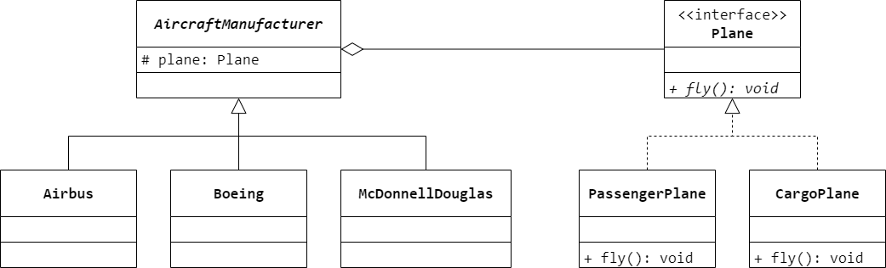
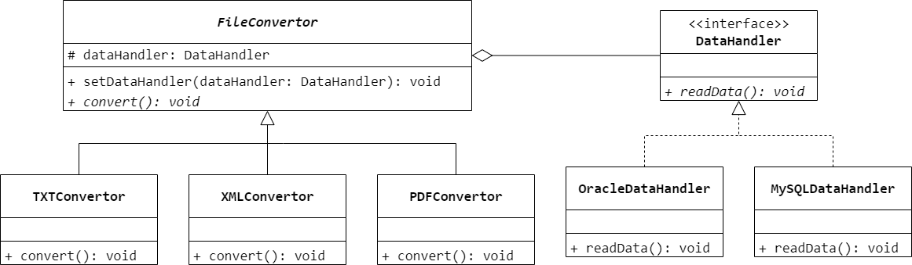

### 第 10 章　桥接模式
1.　（$① \ B$）设计模式将抽象部分与它实现部分相分离，使它们都可以独立变化。图 10-7 所示为该设计模式的类图，其中（$② \ D$）用于定义实现部分的接口。

$① \ A.$ Singleton（单例） $B.$ Bridge（桥接） $C.$ Composite（组合） $D.$ Facade（外观）

$② \ A.$ `Abstraction` $B.$ `ConcreteImplementorA` $C.$ `ConcreteImplementorB` $D.$ `Implementor`

<br/>

2.　以下关于桥接模式的叙述错误的是（$C$）。

$A.$ 桥接模式的用意是将抽象化与现实化脱耦，使得两者可以独立变化

$B.$ 桥接模式将继承关系转换成关联模式，从而降低系统的耦合度

$C.$ 桥接模式可以动态地给一个对象增加功能，这些功能也可以被动态的地撤销

$D.$ 桥接模式可以从接口中分离实现功能，使得设计更具有扩展性

<br/>

3.　（$C$）不是桥接模式所适用的场景。

$A.$ 一个可以跨平台并支持多种格式的文件编辑器

$B.$ 一个支持多数据源的报表生成工具，可以用不同的图形方式显示报表信息

$C.$ 一个可动态选择排序算法的数据操作工具

$D.$ 一个支持多种编程语言的跨平台开发工具

<br/>

4.　如果系统中存在两个以上的变化维度，是否可以使用桥接模式进行处理？如果可以，系统该如何设计？

桥接模式可以处理存在多个独立变化维度的系统，每一个独立维度对应一个继承结构，其中一个为“抽象类”层次结构，其他为“实现类”层次结构，“抽象类”层次结构中的抽象类和“实现类”层次结构中的接口之间存在抽象耦合关系。

<br/>

5.　空客（Airbus）、波音（Boeing）和麦道（McDonnell-Douglas）都是飞机制造商，它们都生产载客飞机（Passenger Plane）和载货飞机（Cargo Plane）。现在需要设计一个系统，描述这些飞机制造商以及它们所制造的飞机种类。



<br/>

6.　某软件公司要开发一个数据转换工具，可以将数据库中的数据转换成多种文件格式，例如 TXT、XML、PDF 等格式，同时该工具需要支持多种不同的数据库。试使用桥接模式对其进行设计并使用 Java 代码编程模拟实现。



```Java
public interface DataHandler {
    void readData();
}
```

```Java
public class OracleDataHandler implements DataHandler {
    @Override
    public void readData() {

    }
}
```

```Java
public class MySQLDataHandler implements DataHandler {
    @Override
    public void readData() {

    }
}
```

```Java
public abstract class FileConvertor {
    protected DataHandler dataHandler;
    public void setDataHandler(DataHandler dataHandler) {
        this.dataHandler = dataHandler;
    }
    public abstract void convert();
}
```

```Java
public class TXTConvertor extends FileConvertor {
    @Override
    public void convert() {
        
    }
}
```

```Java
public class XMLConvertor extends FileConvertor {
    @Override
    public void convert() {
        
    }
}
```

```Java
public class PDFConvertor extends FileConvertor {
    @Override
    public void convert() {

    }
}
```