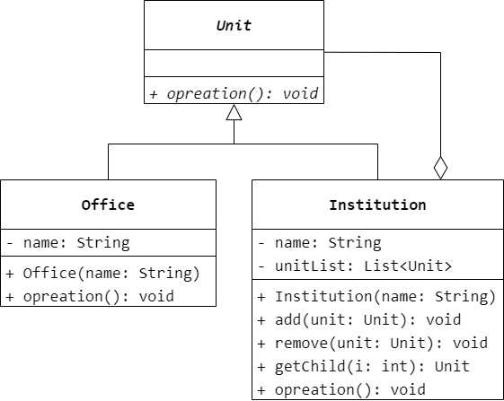
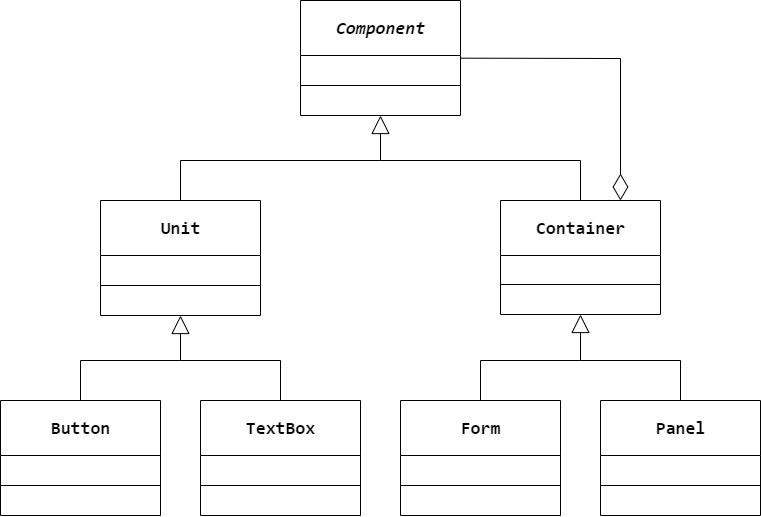

### 第 11 章　组合模式
1.　一个树形文件系统体现了（$B$）模式。

$A.$ Decorator（装饰）

$B.$ Composite（组合）

$C.$ Bridge（桥接）

$D.$ Proxy（代理）

<br/>

2.　以下关于组合模式的叙述错误的是（$B$）。

$A.$ 组合模式对叶子对象和组合对象的使用具有一致性

$B.$ 组合模式可以很方便地保证在一个容器中只能有某些特定的构件

$C.$ 组合模式将对象组织到树形结构中，可以用来描述整体与部分的关系

$D.$ 组合模式使得可以很方便地在组合体中加入新的对象构件，客户端不需要因为
加入新的对象构件而更改类库代码

<br/>

3.　现需要开发一个 XML 文档处理软件，可以根据关键字查询指定内容，用户可以在 
XML 中任意选取某一结点作为查询的初始结点，无须关心该结点所处的层次结构。针对
该需求可以使用（$C$）模式进行设计。

$A.$ Abstract Factory（抽象工厂）

$B.$ Flyweight（享元）

$C.$ Composite（组合）

$D.$ Strategy（策略）

<br/>

4.　在组合模式结构图中，如果聚合关联关系不是从 `Composite` 到 C`omponent`，而是从 `Composite` 到 `Leaf`，如图 11-8 所示，会产生怎样的结果？

`Composite` 对象中只能包含 `Leaf` 对象，不能再继续包含 `Composite` 对象，导致无法递归构造出一个多层树形结构。

<br/>

5.　某教育机构组织结构如图 11-9 所示。在该教育机构的 OA 系统中可以给各级办公室下发公文，现采用组合模式设计该机构的组织结构，绘制相应的类图并使用 Java 语言编程模拟实现，在客户端代码中模拟下发公文。



```Java
public abstract class Unit {
    public abstract void operation();
}
```

```Java
public class Office extends Unit {
    private String name;
    public Office(String name) {
        this.name = name;
    }
    @Override
    public void operation() {

    }
}
```

```Java
public class Institution extends Unit {
    private String name;
    private List<Unit> unitList = new ArrayList<>();
    public Institution(String name) {
        this.name = name;
    }
    public void add(Unit unit) {
        unitList.add(unit);
    }
    public void remove(Unit unit) {
        unitList.remove(unit);
    }
    public Unit getChild(int i) {
        return unitList.get(i);
    }
    @Override
    public void operation() {
        for (int i = 0; i < unitList.size(); i++) {
            Unit unit = unitList.get(i);
            unit.operation();
        }
    }
}
```

<br/>

6.　某软件公司要开发一个界面控件库，界面控件分为两大类，一类是单元控件，例如按钮、文本框等，一类是容器控件，例如窗体、中间面板等，试用组合模式设计该界面控件库。

