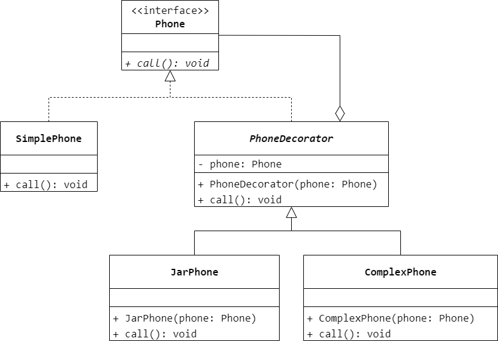
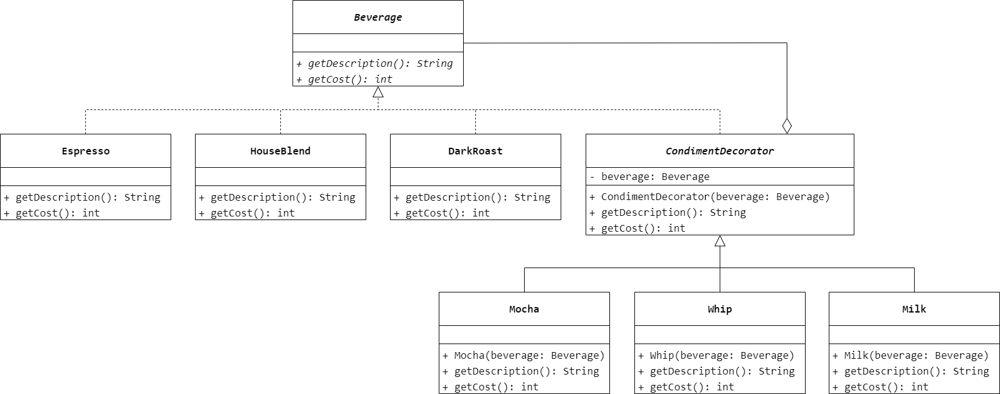

### 第 12 章　装饰模式
1.　当不能采用生成子类的方法进行扩充时可采用（$D$）设计模式动态地给一个对象添加一些额外的职责。

$A.$ Facade（外观）

$B.$ Singleton（单例）

$C.$ Participant（参与者）

$D.$ Decorator（装饰）

<br/>

2.　以下（$C$）不是装饰模式的适用条件。

$A.$ 要扩展一个类的功能或给一个类增加附加责任

$B.$ 要动态地给一个对象增加功能，这些功能还可以动态撤销

$C.$ 要动态地组合多于一个的抽象化角色和实现化角色

$D.$ 要通过一些基本功能的组合产生复杂功能，而不使用继承关系

<br/>

3.　半透明装饰模式能否实现对同一个对象的多次装饰？为什么？

不能实现对用一个对象的多次装饰。因为在半透明装饰模式中，使用具体装饰类来声明装饰之后的对象，具体装饰类中新增的方法并未在抽象构件类中声明，这样做的优点在于装饰后客户端可以单独调用在具体装饰类中新增的业务方法，但是将导致无法调用到之前装饰时新增的方法，只能调用到最后一次装饰时具体装饰类中新增加的方法，故对同一个对象实施多次装饰没有任何意义。

<br/>

4.　最简单的手机（`SimplePhone`）在接收到来电的时候会发出声音提醒主人，现在需要为该手机添加一项功能，在接收来电的时候除了有声音还能产生振动（`JarPhone`）；还可以得到更加高级的手机（`ComplexPhone`），来电时它不仅能够发声，产生振动，而且有灯光闪烁提示。现用装饰模式来模拟手机功能的升级过程，要求绘制类图并使用 Java 语言编程模拟实现。



```Java
public interface Phone {
    void call();
}
```

```Java
public class SimplePhone implements Phone {
    @Override
    public void call() {
        System.out.println("发出声音");
    }
}
```

```Java
public abstract class PhoneDecorator implements Phone {
    private Phone phone;
    public PhoneDecorator(Phone phone) {
        this.phone = phone;
    }
    @Override
    public void call() {
        phone.call();
    }
}
```

```Java
public class JarPhone extends PhoneDecorator {
    public JarPhone(Phone phone) {
        super(phone);
    }
    @Override
    public void call() {
        super.call();
        System.out.println("产生振动");
    }
}
```

```Java
public class ComplexPhone extends PhoneDecorator {
    public ComplexPhone(Phone phone) {
        super(phone);
    }
    @Override
    public void call() {
        super.call();
        System.out.println("产生振动");
        System.out.println("灯光闪烁");
    }
}
```

<br/>

5.　某咖啡店在卖咖啡时可以根据顾客的要求在其中加入各种配料，咖啡店会根据所加入的配料来计算总费用。咖啡店所供应的咖啡及配料的种类和价格如表 12-1 所示。

| 咖啡 | 价格/杯（￥） | 配料 | 价格/份（￥） |
| - | - | - | - |
| 浓缩咖啡（`Espresso`） | 25 | 摩卡（`Mocha`） | 10 |
| 混合咖啡（`House Blend`） | 30 | 奶泡（`Whip`） | 8 |
| 重烘焙咖啡（`Dark Roast`） | 20 | 牛奶（`Milk`） | 6 |

现使用装饰模式为该咖啡店设计一个程序以实现计算费用的功能，输出每种饮料的详细描述及花费。

输出结果示例如下：

```Java
浓缩咖啡，摩卡，牛奶 ¥41
```

饮料类 `Beverage` 的代码如下：

```Java
public abstract class Beverage {
    public abstract String getDescription();
    public abstract int getCost();
}
```

要求画出对应的类图，并使用 Java 语言编程实现。



```Java
public abstract class Beverage {
    public abstract String getDescription();
    public abstract int getCost();
}
```

```Java
public class Espresso extends Beverage {
    @Override
    public String getDescription() {
        return "浓缩咖啡";
    }
    @Override
    public int getCost() {
        return 25;
    }
}
```

```Java
public class HouseBlend extends Beverage {
    @Override
    public String getDescription() {
        return "混合咖啡";
    }
    @Override
    public int getCost() {
        return 30;
    }
}
```

```Java
public class DarkRoast extends Beverage {
    @Override
    public String getDescription() {
        return "重烘焙咖啡";
    }
    @Override
    public int getCost() {
        return 20;
    }
}
```

```Java
public abstract class CondimentDecorator extends Beverage {
    private Beverage beverage;
    public CondimentDecorator(Beverage beverage) {
        this.beverage = beverage;
    }
    @Override
    public String getDescription() {
        return beverage.getDescription();
    }
    @Override
    public int getCost() {
        return beverage.getCost();
    }
}
```

```Java
public class Mocha extends CondimentDecorator {
    public Mocha(Beverage beverage) {
        super(beverage);
    }
    @Override
    public String getDescription() {
        return super.getDescription() + "，摩卡";
    }
    @Override
    public int getCost() {
        return super.getCost() + 10;
    }
}
```

```Java
public class Whip extends CondimentDecorator {
    public Whip(Beverage beverage) {
        super(beverage);
    }
    @Override
    public String getDescription() {
        return super.getDescription() + "，奶泡";
    }
    @Override
    public int getCost() {
        return super.getCost() + 8;
    }
}
```

```Java
public class Milk extends CondimentDecorator {
    public Milk(Beverage beverage) {
        super(beverage);
    }
    @Override
    public String getDescription() {
        return super.getDescription() + "，牛奶";
    }
    @Override
    public int getCost() {
        return super.getCost() + 6;
    }
}
```

<br/>

6.　某软件公司要开发一个数据加密模块，可以对字符串进行加密。最简单的加密算法通过对字母进行移位来实现，同时提供了稍复杂的逆向输出加密，还提供了更加高级的求模加密。用户先使用最简单的加密算法对字符串进行加密，如果觉得还不够可以对加密之后的结果使用其他加密算法进行二次加密，当然也可以进行第三次加密。试使用装饰模式设计该多重加密系统。

