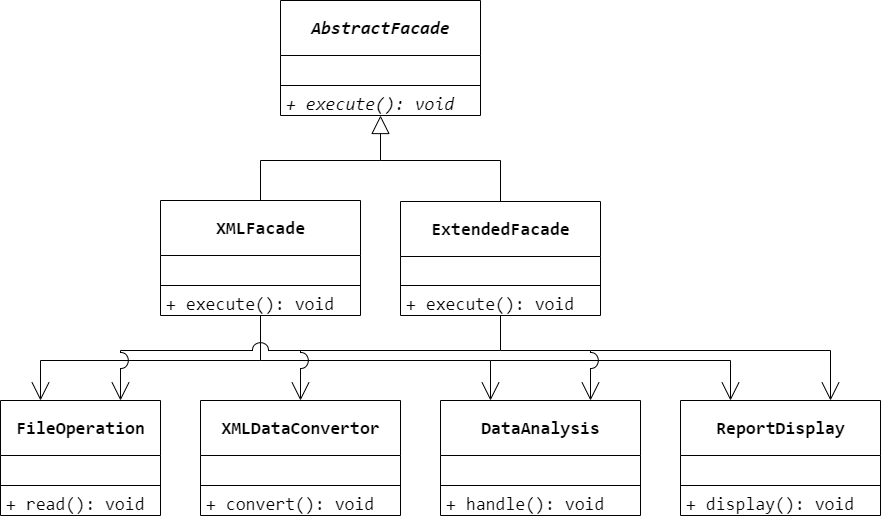
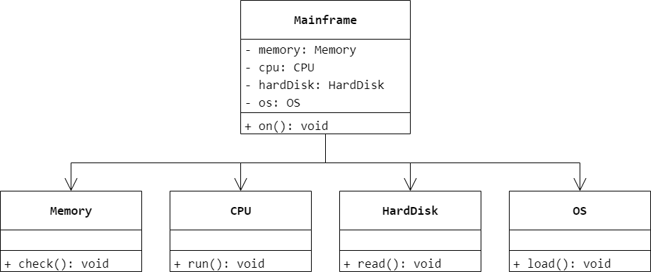
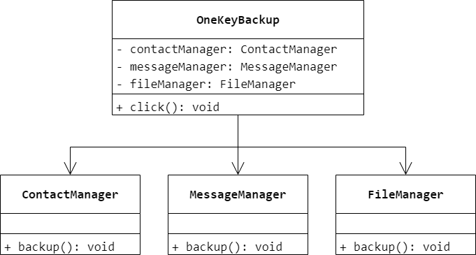

### 第 13 章　外观模式
1.　已知某子系统为外界提供功能服务，但该子系统中存在很多粒度十分小的类，不便被外界系统直接使用，采用（$A$）设计模式可以定义一个高层接口，这个接口使得这一子系统更加容易使用。

$A.$ Facade（外观）

$B.$ Singleton（单例）

$C.$ Participant（参与者）

$D.$ Decorator（装饰）

<br/>

2.　图 13-6 是（$D$）模式实例的结构图。

$A.$ 桥接（Bridge）

$B.$ 工厂方法（Factory Method）

$C.$ 模板方法（Template Method）

$D.$ 外观（Facade）

<br/>

3.　以下关于外观模式的叙述错误的是（$C$）。

$A.$ 在外观模式中，一个子系统的外部与其内部的通信可以通过一个统一的外观对象进行

$B.$ 在增加外观对象之后，客户类只需要直接和外观对象交互即可，与子系统类之间的复杂引用关系由外观对象来实现，降低了系统的耦合度

$C.$ 外观模式可以很好地限制客户类使用子系统类，对客户类访问子系统类做限制可以提高系统的灵活性

$D.$ 可以为一个系统提供多个外观类

<br/>

4.　某信息系统需要提供一个数据处理和报表显示模块，该模块可以读取不同类型的文件中的数据并将数据转换成 XML 格式，然后对数据进行统计分析，最后以报表方式来显示数据。由于该过程需要涉及多个类，试使用外观模式设计该数据处理和报表显示模块。考虑到有些文件本身已经是 XML 格式，无须进行格式转换，为了让系统具有更好的扩展性，在系统设计中可以引入抽象外观类。



<br/>

5.　在电脑主机（`Mainframe`）中只需要按下主机的开机按钮（`on()`），即可调用其他硬件设备和软件的启动方法，如内存（`Memory`）的自检（`check()`）、`CPU` 的运行（`run()`）、硬盘（`HardDisk`）的读取（`read()`）、操作系统（`OS`）的载入（`load()`）等，如果某一过程发生错误则电脑启动失败。使用外观模式模拟该过程，绘制类图并使用 Java 语言编程模拟实现。



```Java
public class Memory {
    public void check() {

    }
}
```

```Java
public class CPU {
    public void run() {

    }
}
```

```Java
public class HardDisk {
    public void read() {

    }
}
```

```Java
public class OS {
    public void load() {

    }
}
```

```Java
public class Mainframe {
    private Memory memory = new Memory();
    private CPU cpu = new CPU();
    private HardDisk hardDisk = new HardDisk();
    private OS os = new OS();
    private void on() {
        memory.check();
        cpu.run();
        hardDisk.read();
        os.load();
    }
}
```

<br/>

6.　某软件公司为新开发的智能手机控制与管理软件提供了一键备份功能，通过该功能可以将原本存储在手机中的通信录、短信、照片、歌曲等资料一次性全部复制到移动存储介质（例如 MMC 卡或 SD 卡）中。在实现过程中需要与多个已有的类进行交互，例如通讯录管理类、短信管理类等，为了降低系统的耦合度，试使用外观模式来设计并使用 Java 语言编程模拟实现该一键备份功能。



```Java
public class FileManager {
    public void backup() {

    }
}
```

```Java
public class MessageManager {
    public void backup() {

    }
}
```

```Java
public class FileManager {
    public void backup() {

    }
}
```

```Java
public class OneKeyBackup {
    private ContactManager contactManager;
    private MessageManager messageManager;
    private FileManager fileManager;
    public void click() {
        contactManager.backup();
        messageManager.backup();
        fileManager.backup();
    }
}
```