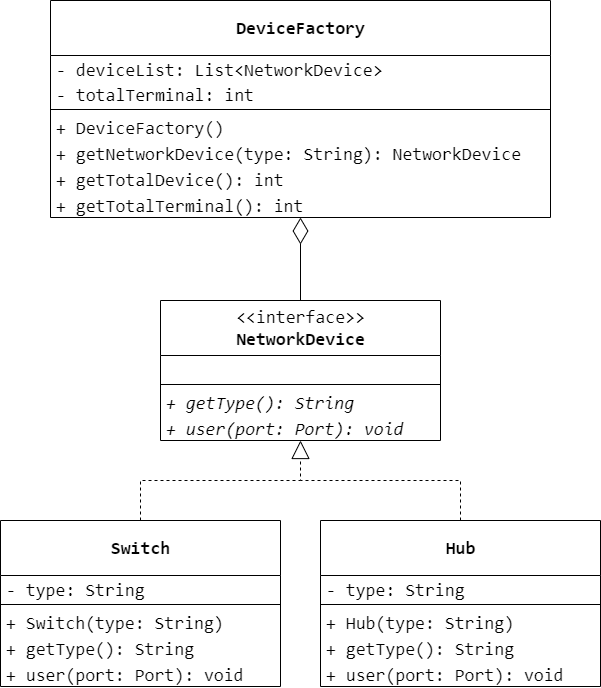
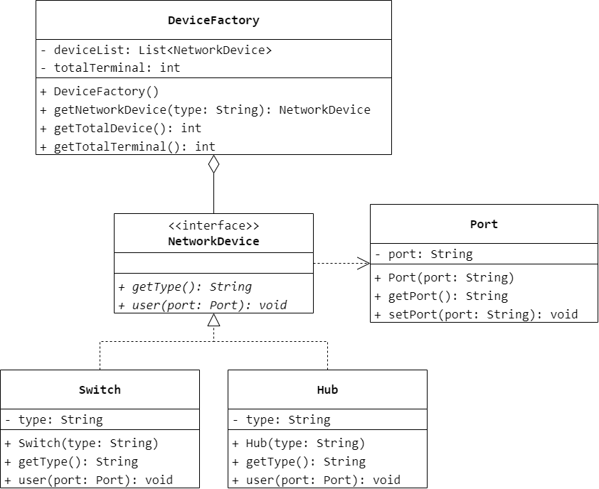
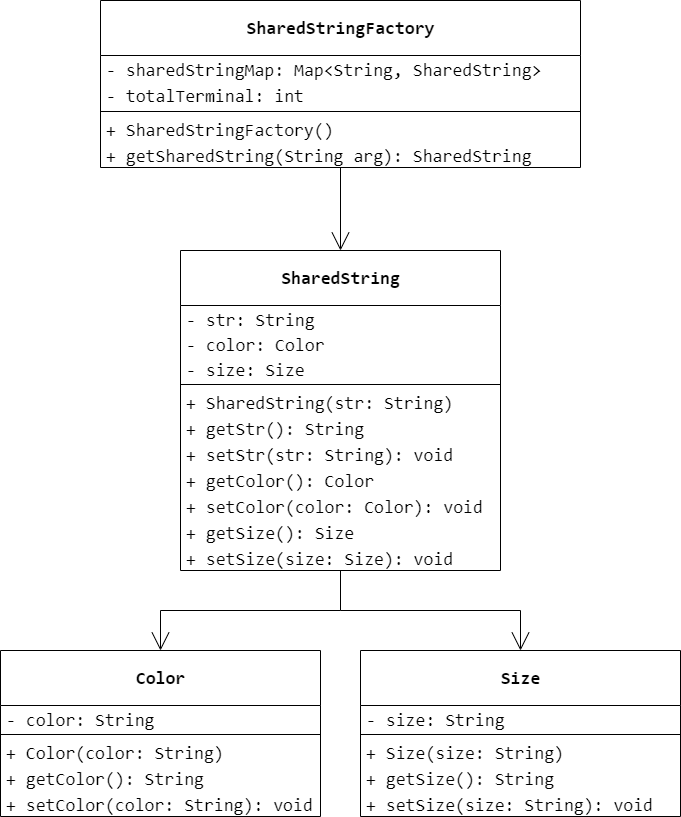
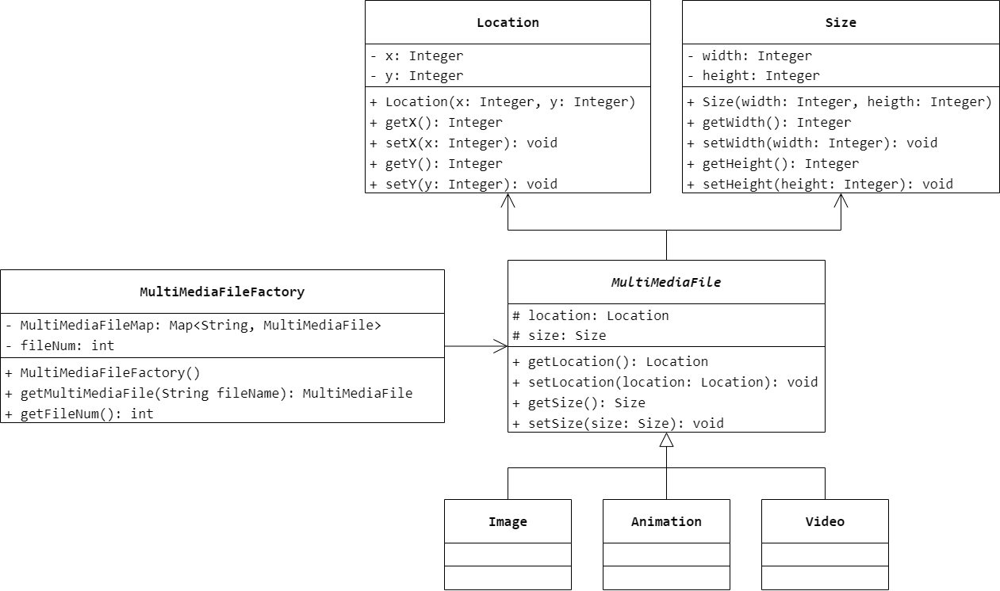

### 第 14 章　享元模式
1.　当应用程序由于使用大量的对象造成很大的存储开销时，可以采用（$C$）设计模式
运用共享技术来有效地支持大量细粒度对象的重用。

$A.$ Facade（外观）

$B.$ Composite（组合）

$C.$ Flyweight（享元）

$D.$ Adapter（适配器）

<br/>

2.　在享元模式中，外部状态是指（$D$）。

$A.$ 享元对象可共享的所有状态

$B.$ 享元对象可共享的部分状态

$C.$ 由享元对象自己保存和维护的状态

$D.$ 由客户端保存和维护的状态

<br/>

3.　以下关于享元模式的叙述错误的是（$C$）。

$A.$ 享元模式运用共享技术有效地支持大量细粒度对象的复用

$B.$ 在享元模式中可以多次使用某个对象，通过引入外部状态使得这些对象可以有所差异

$C.$ 享元对象能够做到共享的关键是引入了享元池，在享元池中通过克隆方法向客户端返回所需对象

$D.$ 在享元模式中，外部状态是随环境改变而改变、不可以共享的状态，内部状态是不随环境改变而改变、可以共享的状态

<br/>

4.　很多网络设备都是支持共享的，如交换机、集线器等，多台终端计算机可以连接同一台网络设备，并通过该网络设备进行数据转发，试使用享元模式模拟共享网络设备的设计原理，绘制类图并使用 Java 语言模拟实现。虽然网络设备可以共享，但是分配给每一个终端计算机的端口（Port）是不同的，因此多台计算机虽然可以共享同一个网络设备，但必须使用不同的端口，可以将端口从网络设备中抽取出来作为外部状态，在需要是再进行配置，试对之前的设计方案进行改进绘制改进之后的类图并使用 Java 语言模拟实现这个带有外部状态的享元模式实例。



```Java
public interface NetworkDevice {
    String getType();
    void use();
}
```

```Java
public class Switch implements NetworkDevice {
    private String type;
    public Switch(String type) {
        this.type = type;
    }
    public String getType() {
        return type;
    }
    public void use() {

    }
}
```

```Java
public class Hub implements NetworkDevice {
    private String type;
    public Hub(String type) {
        this.type = type;
    }
    public String getType() {
        return type;
    }
    public void use() {

    }
}
```

```Java
public class DeviceFactory {
    private List<NetworkDevice> deviceList = new ArrayList<>();
    private int totalTerminal = 0;
    public DeviceFactory() {
        deviceList.add(new Switch("Switch"));
        deviceList.add(new Hub("Hub"));
    }
    public NetworkDevice getNetworkDevice(String type) {
        if (Objects.equals(type, "Switch") == true) {
            totalTerminal++;
            return deviceList.get(0);
        }
        else if (Objects.equals(type, "Hub") == true) {
            totalTerminal++;
            return deviceList.get(1);
        }
        return null;
    }
    public int getTotalDevice() {
        return deviceList.size();
    }
    public int getTotalTerminal() {
        return totalTerminal;
    }
}
```



```Java
public class Port {
    private String port;
    public Port(String port) {
        this.port = port;
    }
    public String getPort() {
        return port;
    }
    public void setPort(String port) {
        this.port = port;
    }
}
```

```Java
public interface NetworkDevice {
    String getType();
    void use(Port port);
}
```

```Java
public class Switch implements NetworkDevice {
    private String type;
    public Switch(String type) {
        this.type = type;
    }
    public String getType() {
        return type;
    }
    public void use(Port port) {

    }
}
```

```Java
public class Hub implements NetworkDevice {
    private String type;
    public Hub(String type) {
        this.type = type;
    }
    public String getType() {
        return type;
    }
    public void use(Port port) {

    }
}
```

```Java
public class DeviceFactory {
    private List<NetworkDevice> deviceList = new ArrayList<>();
    private int totalTerminal = 0;
    public DeviceFactory() {
        deviceList.add(new Switch("Switch"));
        deviceList.add(new Hub("Hub"));
    }
    public NetworkDevice getNetworkDevice(String type) {
        if (Objects.equals(type, "Switch") == true) {
            totalTerminal++;
            return deviceList.get(0);
        }
        else if (Objects.equals(type, "Hub") == true) {
            totalTerminal++;
            return deviceList.get(1);
        }
        return null;
    }
    public int getTotalDevice() {
        return deviceList.size();
    }
    public int getTotalTerminal() {
        return totalTerminal;
    }
}
```

<br/>

5.　在屏幕中显示一个文本文档，其中相同的字符串“Java”共享同一个对象，而这些符串的颜色和大小可以不同。现使用享元模式设计一个方案实现字符串对象的共享，要求绘制类图并使用 Java 语言编程实现。



```Java
public class Color {
    private String color;
    public Color(String color) {
        this.color = color;
    }
    public String getColor() {
        return color;
    }
    public void setColor(String color) {
        this.color = color;
    }
}
```

```Java
public class Size {
    private String size;
    public Size(String size) {
        this.size = size;
    }
    public String getSize() {
        return size;
    }
    public void setSize(String size) {
        this.size = size;
    }
}
```

```Java
public class SharedString {
    private String str;
    private Color color;
    private Size size;
    public SharedString(String str) {
        this.str = str;
    }
    public String getStr() {
        return str;
    }
    public void setStr(String str) {
        this.str = str;
    }
    public Color getColor() {
        return color;
    }
    public void setColor(Color color) {
        this.color = color;
    }
    public Size getSize() {
        return size;
    }
    public void setSize(Size size) {
        this.size = size;
    }
}
```

```Java
public class SharedStringFactory {
    private Map<String, SharedString> SharedStringMap;
    public SharedStringFactory() {
        SharedStringMap = new HashMap<>();
    }
    public SharedString getSharedStringFactory(String arg) {
        if (SharedStringMap.containsKey(arg) == false) {
            SharedString sharedString = new SharedString(arg);
            SharedStringMap.put(arg, sharedString);
        }
        return SharedStringMap.get(arg);
    }
}
```

<br/>

6.　某软件公司要开发一个多功能文档编辑器，在文本文档中可以插入图片、动画、视频等多媒体资料。为了节约系统资源，相同的图片、动画和视频在同一个文档中只需保存一份，但是可以多次重复出现，而且它们每次出现时位置和大小均可不同。试使用享元模式设计该文档编辑器。

