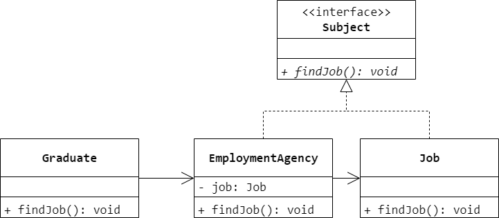
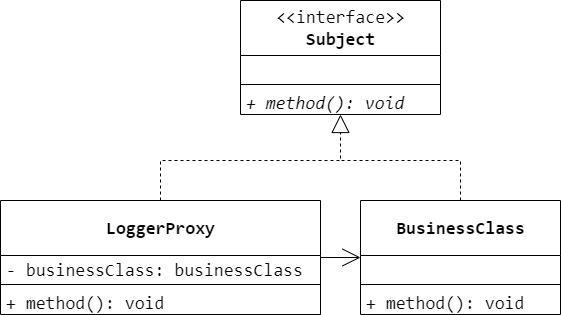
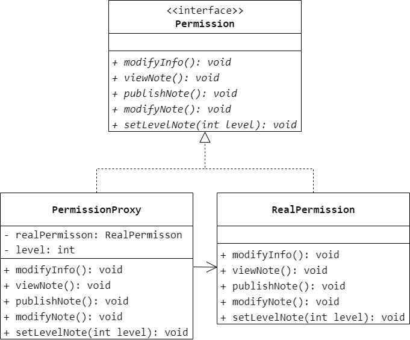

### 第 15 章　代理模式
1.　Windows 操作系统中的应用程序快捷方式是（$A$）模式的应用实例。

$A.$ 代理（Proxy）

$B.$ 组合（Composite）

$C.$ 装饰（Decorator）

$D.$ 外观（Facade）

<br/>

2.　以下关于代理模式的叙述错误的是（$B$）。

$A.$ 代理模式能够协调调用者和被调用者，从而在一定程度上降低系统的耦合度

$B.$ 控制对一个对象的访问，给不同的用户提供不同级别的使用权限时可以考虑使用远程代理

$C.$ 代理模式的缺点是请求的处理速度会变慢，并且实现代理模式需要额外的工作

$D.$ 代理模式给某一个对象提供一个代理，并由代理对象控制对原对象的引用

<br/>

3.　代理模式有多种类型，其中智能引用代理是指（$D$）。

$A.$ 为某一个目标操作的结果提供临时的存储空间，以便多个客户端可以共享这些结果

$B.$ 保护目标不让恶意用户接近

$C.$ 使几个用户能够同时使用一个对象而没有冲突

$D.$ 当一个对象被引用时提供一些额外的操作，例如将此对象被调用的次数记录下来

<br/>

4.　毕业生通过职业介绍所找工作，请问该过程蕴含了哪种设计模式，绘制相应的类图。



<br/>

5.　在某应用软件中需要记录业务方法的调用日志，在不修改现有业务类的基础上为每个类提供一个日志记录代理类，在代理类中输出日志，例如在业务方法 `method()` 调用之前输出“方法 `method()` 被调用，调用时间为 2017-11-5 10:10:10”，调用之后如果没有抛异常则输出“方法 `method()` 调用成功”，否则输出“方法 `method()` 调用失败”。在代理类中调用真实业务类的业务方法，使用代理模式设计该日志记录模块的结构，绘制类图并使用 Java 语言编程模拟实现。



```Java
public interface Subject {
    void method();
}
```

```Java
public class BusinessClass implements Subject {
    @Override
    public void method() {

    }
}
```

```Java
public class LoggerProxy implements Subject {
    private BusinessClass businessClass = new BusinessClass();
    public void prevMethod() {
        System.out.println("方法 method() 被调用，调用时间为 2017-11-5 10:10:10");
    }
    public void postMethod() {
        if (Math.random() < 0.5) {
            System.out.println("方法 method() 调用成功");
        }
        else {
            System.out.println("方法 method() 调用失败");
        }
    }
    @Override
    public void method() {
        prevMethod();
        businessClass.method();
        postMethod();
    }
}
```

<br/>

6.　在一个论坛中已注册用户和游客的权限不同，已注册的用户拥有发帖、修改自己的注册信息、修改自己的帖子等功能；而游客只能看到别人发的帖子，没有其他权限。试使用保护代理来设计该权限管理模块。



<br/>

7.　某软件公司要开发一款基于 C/S 的网络图片查看器，具体功能描述如下：用户只需在图片查看器中输入网页 URL，程序会自动将该网页中的所有图片下载到本地，考虑到有些网页图片比较多，而且某些图片文件比较大，因此先以图标的方式显示图片，不同类型的图片使用不同的图标，并且在图标下面标注该图片的文件名，用户单击图标后可查看真正的图片，界面效果如图 15-6 所示。试使用虚拟代理模式设计并实现该图片查看器。（注：可以结合多线程机制，使用一个线程显示小图标，同时启动另一个线程在后台加载原图。）


<br/>

8.　使用 Java RMI 技术开发一个简单的程序，在远程服务器上实现加、减、乘、除等运算，然后在本地调用这些运算。

略。