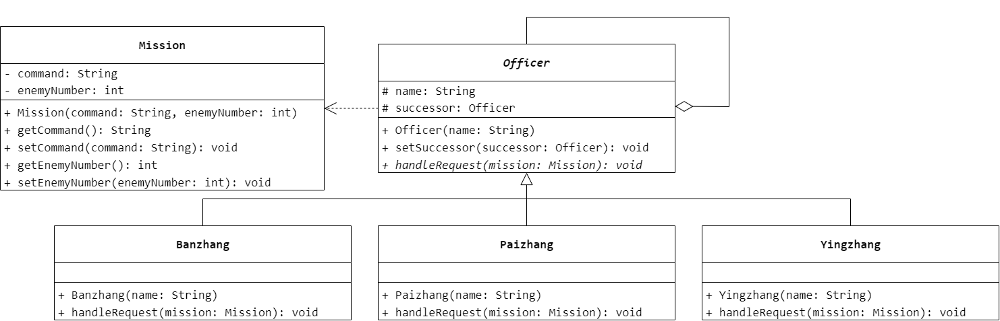
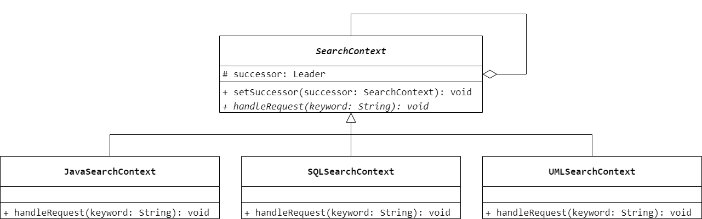
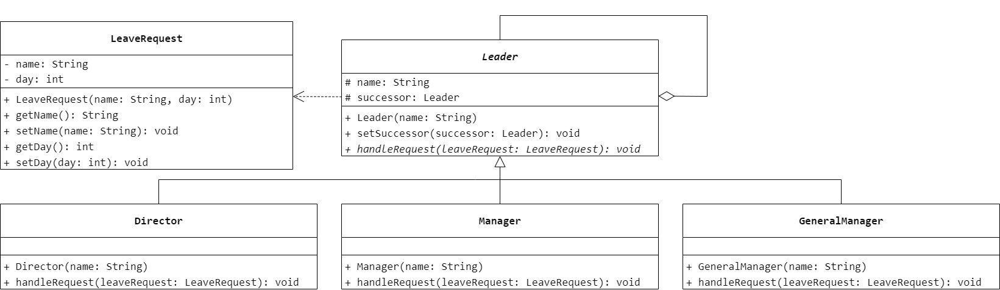

### 第 16 章　职责链模式
1.　图 16-5 描述了一种设计模式，该设计模式不可以（$B$）。

$A.$ 动态决定由一组对象中的某个对象处理该请求

$B.$ 动态指定处理一个请求的对象集合，并高效率地处理一个请求

$C.$ 使多个对象都有机会处理请求，避免请求的发送者和接收者间的耦合关系

$D.$ 将对象连成一条链，并沿着该链传递请求

<br/>

2.　接力赛跑体现了（$A$）设计模式。

$A.$ 职责链（Chain of Responsibility）

$B.$ 命令（Command）

$C.$ 备忘录（Memento）

$D.$ 工厂方法（Factory Method）

<br/>

3.　Java 语言中的异常处理机制是职责链模式的一个应用实例，编写一个包含多个 `catch` 子句的程序，理解异常处理的实现过程，并判断此处使用的是纯的职责链模式还是不纯的职责链模式。

异常处理使用的不是纯的职责链模式，存在一个 `try` 语句中的异常最终没有被任何 `catch` 语句处理的情况，即一个请求可能最终不被任何处理者对象接收并处理。

<br/>

4.　在军队中一般根据战争规模的大小和重要性由不同级别的长官（`Officer`）来下达作战命令，情报人员向上级递交军情（包括敌人的人数等信息），作战命令需要上级批准，如果直接上级不具备下达命令的权力，则又传给他的上级，直到有人可以决定为止。现使用职责链模式来模拟该过程，客户类模拟情报人员，首先向级别最低的班长（`Banzhang`）递交任务书（`Mission`），即军情，如果超出班长的权力范围，则传递给排长（`Paizhang`），如果排长也不能处理则传递给营长（`Yingzhang`），如果营长也不能处理则需要开会讨论。设置这几级长官的权力范围分别如下：（1）敌人数量 < 10，班长下达作战命令；（2）10 <= 敌人数量 < 50，排长下达作战命令；（3）50 <= 敌人数量 < 200，营长下达作战命令；（4）敌人数量 >= 200，需要开会讨论再下达作战命令。要求绘制相应的类图并使用 Java 语言编程模拟实现。



```Java
public class Mission {
    private String command;
    private int enemyNumber;
    public Mission(String command, int enemyNumber) {
        this.command = command;
        this.enemyNumber = enemyNumber;
    }
    public String getCommand() {
        return command;
    }
    public void setCommand(String command) {
        this.command = command;
    }
    public int getEnemyNumber() {
        return enemyNumber;
    }
    public void setEnemyNumber(int enemyNumber) {
        this.enemyNumber = enemyNumber;
    }
}
```

```Java
public abstract class Officer {
    protected String name;
    protected Officer successor;
    public Officer(String name) {
        this.name = name;
    }
    public void setSuccessor(Officer successor) {
        this.successor = successor;
    }
    public abstract void handleRequest(Mission mission);
}
```

```Java
public class Banzhang extends Officer {
    public Banzhang(String name) {
        super(name);
    }
    @Override
    public void handleRequest(Mission mission) {
        if (mission.getEnemyNumber() < 10) {
            System.out.println("班长" + name + "下达作战命令" + mission.getCommand());
        }
        else {
            if (successor != null) {
                successor.handleRequest(mission);
            }
        }
    }
}
```

```Java
public class Paizhang extends Officer {
    public Paizhang(String name) {
        super(name);
    }
    @Override
    public void handleRequest(Mission mission) {
        if (mission.getEnemyNumber() >= 10 && mission.getEnemyNumber() < 50) {
            System.out.println("排长" + name + "下达作战命令" + mission.getCommand());
        }
        else {
            if (successor != null) {
                successor.handleRequest(mission);
            }
        }
    }
}
```

```Java
public class Yingzhang extends Officer {
    public Yingzhang(String name) {
        super(name);
    }
    @Override
    public void handleRequest(Mission mission) {
        if (mission.getEnemyNumber() >= 50 && mission.getEnemyNumber() < 200) {
            System.out.println("营长" + name + "下达作战命令" + mission.getCommand());
        }
        else {
            System.out.println("开会讨论再下达作战命令");
        }
    }
}
```

<br/>

5.　某公司要开发一个软件系统的在线文档帮助系统，用户可以在任何一个查询上下文中输入查询关键字，如果当前查询环境下没有相关内容，则系统会将查询按照一定的顺序转发给其他查询环境。基于上述需求，试采用职责链模式对该系统进行设计。



```Java
public abstract class SearchContext {
    protected SearchContext successor;
    public void setSuccessor(SearchContext successor) {
        this.successor = successor;
    }
    public abstract void handleRequest(String keyword);
}
```

```Java
public class JavaSearchContext extends SearchContext {
    @Override
    public void handleRequest(String keyword) {
        if (keyword.contains("Java") == true) {
            System.out.println("查询关键字：Java");
        }
        else {
            successor.handleRequest(keyword);
        }
    }
}
```

```Java
public class SQLSearchContext extends SearchContext {
    @Override
    public void handleRequest(String keyword) {
        if (keyword.contains("SQL") == true) {
            System.out.println("查询关键字：SQL");
        }
        else {
            successor.handleRequest(keyword);
        }
    }
}
```

```Java
public class UMLSearchContext extends SearchContext {
    @Override
    public void handleRequest(String keyword) {
        if (keyword.contains("UML") == true) {
            System.out.println("查询关键字：UML");
        }
        else {
            successor.handleRequest(keyword);
        }
    }
}
```

<br/>

6.　某 OA 系统需要提供一个假条审批模块：如果员工请假天数小于 3 天，主任可以审批该假条；如果员工请假天数大于等于 3 天，小于 10 天，经理可以审批；如果员工请假天数大于等于 10 天，小于 30 天，总经理可以审批；如果超过 30 天，总经理也不能审批，提示相应的拒绝信息。试使用职责链模式设计该假条审批模块，要求绘制相应的类图并使用 Java 语言编程实现。



```Java
public class LeaveRequest {
    private String name;
    private int day;
    public LeaveRequest(String name, int day) {
        this.name = name;
        this.day = day;
    }
    public String getName() {
        return name;
    }
    public void setName(String name) {
        this.name = name;
    }
    public int getDay() {
        return day;
    }
    public void setDay(int day) {
        this.day = day;
    }
}
```

```Java
public abstract class Leader {
    protected String name;
    protected Leader successor;
    public Leader(String name) {
        this.name = name;
    }
    public void setSuccessor(Leader successor) {
        this.successor = successor;
    }
    public abstract void handleRequest(LeaveRequest leaveRequest);
}
```

```Java
public class Director extends Leader {
    public Director(String name) {
        super(name);
    }
    @Override
    public void handleRequest(LeaveRequest leaveRequest) {
        if (leaveRequest.getDay() < 3) {
            System.out.println("主任" + name + "审批假条" + leaveRequest.getName());
        }
        else {
            if (successor != null) {
                successor.handleRequest(leaveRequest);
            }
        }
    }
}
```

```Java
public class Manager extends Leader {
    public Manager(String name) {
        super(name);
    }
    @Override
    public void handleRequest(LeaveRequest leaveRequest) {
        if (leaveRequest.getDay() >= 3 && leaveRequest.getDay() < 10) {
            System.out.println("经理" + name + "审批假条" + leaveRequest.getName());
        }
        else {
            if (successor != null) {
                successor.handleRequest(leaveRequest);
            }
        }
    }
}
```

```Java
public class GeneralManager extends Leader {
    public GeneralManager(String name) {
        super(name);
    }
    @Override
    public void handleRequest(LeaveRequest leaveRequest) {
        if (leaveRequest.getDay() >= 10 && leaveRequest.getDay() < 30) {
            System.out.println("总经理" + name + "审批假条" + leaveRequest.getName());
        }
        else {
            System.out.println("拒绝审批假条");
        }
    }
}
```