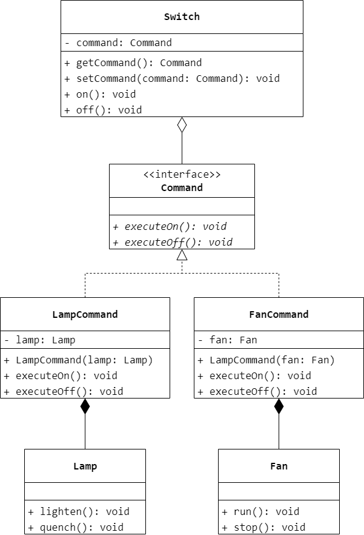
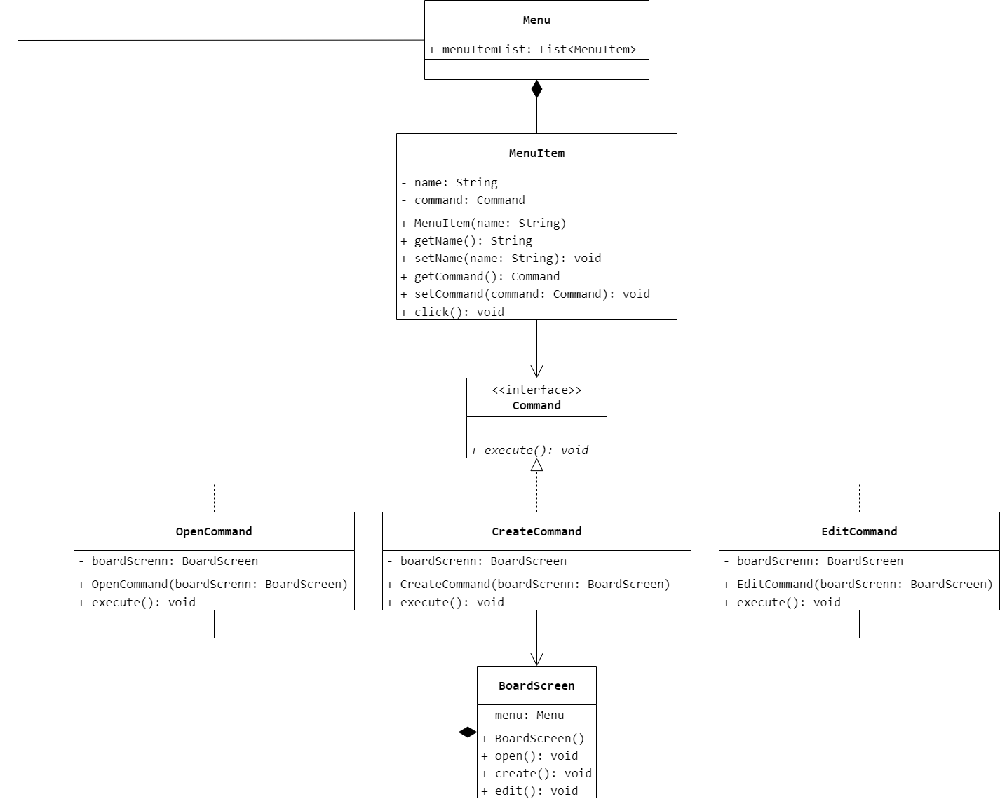

### 第 17 章　命令模式
1.　以下关于命令模式的叙述错误的是（$D$）。

$A.$ 命令模式将一个请求封装为一个对象，从而可用不同的请求对客户进行参数化

$B.$ 命令模式可以将请求发送者和请求接收者解耦

$C.$ 使用命令模式会导致某些系统有过多的具体命令类，导致在有些系统中命令模式变得不切实际

$D.$ 命令模式是对命令的封装，命令模式把发出命令的责任和执行命令的责任集中在同一个类中，委派给统一的类进行处理

<br/>

2.　在（$C$）时无须使用命令模式。

$A.$ 实现撤销（Undo）操作和恢复（Redo）操作

$B.$ 将请求的发送者和接收者解耦

$C.$ 不改变聚合类的前提下定义作用于聚合中元素的新操作

$D.$ 不同的时间指定请求，并将请求排队

<br/>

3.　房间中的开关就是命令模式的一个实现，现用命令模式来模拟开关的功能，可控制对象包括电灯和电风扇，绘制相应的类图并使用 Java 语言编程模拟。



```Java
public class Lamp {
    public void lighten() {

    }
    public void quench() {

    }
}
```

```Java
public class Fan {
    public void run() {

    }
    public void stop() {

    }
}
```

```Java
public interface Command {
    void executeOn();
    void executeOff();
}
```

```Java
public class LampCommand implements Command {
    private Lamp lamp;
    public LampCommand(Lamp lamp) {
        this.lamp = lamp;
    }
    @Override
    public void executeOn() {
        lamp.lighten();
    }
    @Override
    public void executeOff() {
        lamp.quench();
    }
}
```

```Java
public class FanCommand implements Command {
    private Fan fan;
    public FanCommand(Fan fan) {
        this.fan = fan;
    }
    @Override
    public void executeOn() {
        fan.run();
    }
    @Override
    public void executeOff() {
        fan.stop();
    }
}
```

```Java
public class Switch {
    private Command command;
    public Command getCommand() {
        return command;
    }
    public void setCommand(Command command) {
        this.command = command;
    }
    public void on() {
        command.executeOn();
    }
    public void off() {
        command.executeOff();
    }
}
```

<br/>

4.　某系统需要提供一个命令集合（注：可使用 `ArrayList` 等集合对象实现），用于存储一系列命令对象，并通过该命令集合实现多次 `undo()` 和 `redo()` 操作，实现对 17.6 节中的简易计算器实例的改进。

略。

<br/>

5.　设计并实现一个简单的请求日志记录程序，将一组命令对象通过序列化写到日志文件中，并通过该日志文件实现批处理操作。

略。

<br/>

6.　某软件公司要开发一个基于 Windows 平台的公告板系统。系统提供一个主菜单（`Menu`），在主菜单中包含了一些菜单项（`MenuItem`），可以通过 `Menu` 类的 `addMenuItem()` 方法增加菜单项。菜单项的主要方法是 `click()`，每一个菜单项包含一个抽象命令类，具体命令类包括 `openCommand`（打开命令）、`createCommand`（新建命令）、`editCommand`（编辑命令）等，命令类具有一个 `execute()` 方法，用于调用公告板系统界面类（`BoardScreen`）的 `open()`、`create()`、`edit()` 等方法。现使用命令模式设计该系统，使得 `MenuItem` 类与 `BoardScreen` 类的耦合度降低，绘制类图并使用 Java 语言编程实现。



```Java
public class MenuItem {
    private String name;
    private Command command;
    public MenuItem(String name) {
        this.name = name;
    }
    public String getName() {
        return name;
    }
    public void setName(String name) {
        this.name = name;
    }
    public Command getCommand() {
        return command;
    }
    public void setCommand(Command command) {
        this.command = command;
    }
    public void click() {
        command.execute();
    }
}
```

```Java
public class Menu {
    public List<MenuItem> menuItemList = new ArrayList<>();
}
```

```Java
public class BoardScreen {
    private Menu menu;
    private MenuItem openMenuItem;
    private MenuItem createMenuItem;
    private MenuItem editMenuItem;
    public BoardScreen() {
        menu = new Menu();
        openMenuItem = new MenuItem("打开");
        createMenuItem = new MenuItem("新建");
        editMenuItem = new MenuItem("编辑");
        menu.menuItemList.add(openMenuItem);
        menu.menuItemList.add(createMenuItem);
        menu.menuItemList.add(editMenuItem);
    }
    public Menu getMenu() {
        return menu;
    }
    public void open() {

    }
    public void create() {

    }
    public void edit() {

    }
}
```

```Java
public interface Command {
    void execute();
}
```

```Java
public class OpenCommand implements Command {
    private BoardScreen boardScreen;
    public OpenCommand(BoardScreen boardScreen) {
        this.boardScreen = boardScreen;
    }
    @Override
    public void execute() {
        boardScreen.open();
    }
}
```

```Java
public class CreateCommand implements Command {
    private BoardScreen boardScreen;
    public CreateCommand(BoardScreen boardScreen) {
        this.boardScreen = boardScreen;
    }
    @Override
    public void execute() {
        boardScreen.create();
    }
}
```

```Java
public class EditCommand implements Command {
    private BoardScreen boardScreen;
    public EditCommand(BoardScreen boardScreen) {
        this.boardScreen = boardScreen;
    }
    @Override
    public void execute() {
        boardScreen.edit();
    }
}
```