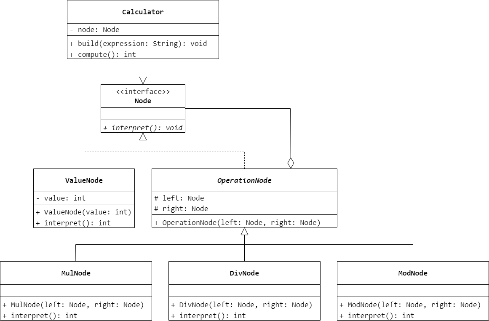
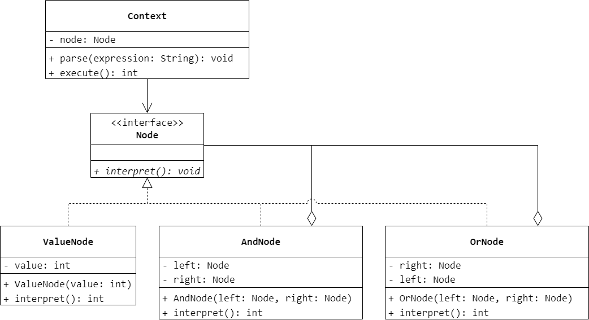

### 第 18 章　解释器模式
1.　对于一个语法不是特别复杂的计算机语言，可以考虑使用（$D$）模式进行设计。

$A.$ 模板方法

$B.$ 命令

$C.$ 访问者

$D.$ 解释器

<br/>

2.　关于解释器模式，以下叙述有误的是（$C$）。

$A.$ 当一个待解释的语言中的句子可以表示为一棵抽象语法树时可以使用解释器模式

$B.$ 在解释器模式中使用类来表示文法规则，可以方便地改变或者扩展文法

$C.$ 解释器模式既适用于文法简单的小语言，也适用于文法非常复杂的语言解析

$D.$ 需要自定义一个小语言，如一些简单的控制指令时，可以考虑使用解释器模式

<br/>

3.　现需要构造一个语言解释器，使得系统可以执行整数间的乘、除和求模运算。例如用户输入表达式“3*4/2%4”，输出结果为 2。使用解释器模式实现该功能，要求绘制相应的类图并使用 Java 语言编程模拟实现。



```Java
public interface Node {
    int interpret();
}
```

```Java
public class ValueNode implements Node {
    private int value;
    public ValueNode(int value) {
        this.value = value;
    }
    @Override
    public int interpret() {
        return value;
    }
}
```

```Java
public abstract class OperationNode implements Node {
    protected Node left;
    protected Node right;
    public OperationNode(Node left, Node right) {
        this.left = left;
        this.right = right;
    }
}
```

```Java
public class MulNode extends OperationNode {
    public MulNode(Node left, Node right) {
        super(left, right);
    }
    @Override
    public int interpret() {
        return right.interpret() * left.interpret();
    }
}
```

```Java
public class DivNode extends OperationNode {
    public DivNode(Node left, Node right) {
        super(left, right);
    }
    @Override
    public int interpret() {
        return right.interpret() / left.interpret();
    }
}
```

```Java
public class ModNode extends OperationNode {
    public ModNode(Node left, Node right) {
        super(left, right);
    }
    @Override
    public int interpret() {
        return right.interpret() % left.interpret();
    }
}
```

```Java
public class Calculator {
    private Node node;
    public void build(String expression) {
        String[] arr = expression.split(" ");
        Deque<Node> stk = new ArrayDeque<>();
        for (int i = 0; i < arr.length; i++) {
            if (Objects.equals(arr[i], "*") == true) {
                Node right = stk.pop();
                int val = Integer.parseInt(arr[++i]);
                Node left = new ValueNode(val);
                stk.push(new MulNode(left, right));
            }
            else if (Objects.equals(arr[i], "/") == true) {
                Node right = stk.pop();
                int val = Integer.parseInt(arr[++i]);
                Node left = new ValueNode(val);
                stk.push(new DivNode(left, right));
            }
            else if (Objects.equals(arr[i], "%") == true) {
                Node right = stk.pop();
                int val = Integer.parseInt(arr[++i]);
                Node left = new ValueNode(val);
                stk.push(new ModNode(left, right));
            }
            else {
                stk.push(new ValueNode(Integer.parseInt(arr[i])));
            }
        }
        node = stk.pop();
    }
    public int compute() {
        return node.interpret();
    }
}
```

<br/>

4.　使用解释器模式设计一个简单的解释器，使得系统可以解释 0 和 1 的或运算和与运算（不考虑或运算和与运算的优先级），语句表达式和输出结果的几个实例如表 18-1 所示。

| 表达式 | 输出结果 | 表达式 | 输出结果 |
| - | - | - | - |
| 1 and 0 | 0 | 0 or 0 | 0 |
| 1 or 1 | 1 | 1 and 1 or 0 | 1 |
| 1 or 0 | 1 | 0 or 1 and 0 | 0 |
| 1 and 1 | 1 | 0 or 1 and 1 or 1 | 1 |
| 0 and 0 | 0 | 1 or 0 and 1 and 0 or 0 | 0 |



```Java
public interface Node {
    int interpret();
}
```

```Java
public class ValueNode implements Node {
    private int value;
    public ValueNode(int value) {
        this.value = value;
    }
    @Override
    public int interpret() {
        return value;
    }
}
```

```Java
public class AndNode implements Node {
    private Node left;
    private Node right;
    public AndNode(Node left, Node right) {
        this.left = left;
        this.right = right;
    }
    @Override
    public int interpret() {
        return left.interpret() & right.interpret();
    }
}
```

```Java
public class OrNode implements Node {
    private Node left;
    private Node right;
    public OrNode(Node left, Node right) {
        this.left = left;
        this.right = right;
    }
    @Override
    public int interpret() {
        return left.interpret() | right.interpret();
    }
}
```

```Java
public class Context {
    private Node node;
    public void parse(String expression) {
        String[] arr = expression.split(" ");
        Deque<Node> stk = new ArrayDeque<>();
        for (int i = 0; i < arr.length; i++) {
            if (Objects.equals(arr[i], "and") == true) {
                Node right = stk.pop();
                int val = Integer.parseInt(arr[++i]);
                Node left = new ValueNode(val);
                stk.push(new AndNode(left, right));
            }
            else if (Objects.equals(arr[i], "or") == true) {
                Node right = stk.pop();
                int val = Integer.parseInt(arr[++i]);
                Node left = new ValueNode(val);
                stk.push(new OrNode(left, right));
            }
            else {
                stk.push(new ValueNode(Integer.parseInt(arr[i])));
            }
        }
        node = stk.pop();
    }
    public int execute() {
        return node.interpret();
    }
}
```

<br/>

5.　某软件公司要为数据库备份和同步开发一套简单的数据库同步指令，通过指令可以对数据库中的数据和结构进行备份，例如输入指令“COPY VIEW FROM srcDB TO desDB”表示将数据库 srcDB 中的所有视图（View）对象复制到数据库 desDB；输入指令“MOVE TABLE Student FROM srcDB TO desDB”表示将数据库 srcDB 中的 Student 表移动至数据库 desDB。试使用解释器模式来设计并使用 Java 语言实现该数据库同步指令。

略。