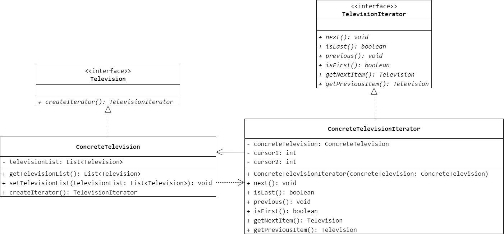

### 第 19 章　迭代器模式
1.　迭代器模式用于处理具有（$B$）性质的类。

$A.$ 抽象

$B.$ 聚集

$C.$ 单例

$D.$ 共享

<br/>

2.　以下关于迭代器模式的叙述错误的是（$D$）。

$A.$ 迭代器模式提供一种方法来访问聚合对象，而无须暴露这个对象的内部表示

$B.$ 迭代器模式支持以不同的方式遍历一个聚合对象

$C.$ 迭代器模式定义了一个访问聚合元素的接口，并且可以跟踪当前遍历的元素，了解哪些元素已经遍历过而哪些没有

$D.$ 在抽象聚合类中定义了访问和遍历元素的方法并在具体聚合类中实现这些方法

<br/>

3.　在迭代器模式中将数据存储与数据遍历分离，数据存储由聚合类负责，数据遍历由迭代器负责，这种设计方案是（$C$）的具体应用。

$A.$ 依赖倒转原则

$B.$ 接口隔离原则

$C.$ 单一职责原则

$D.$ 合成复用原则

<br/>

4.　电视机遥控器是一个迭代器的显示应用，通过它可以实现对电视频道集合的遍历操作，电视机可以看成一个存储频道的聚合对象。试模拟电视机遥控器的实现，要求绘制相应的类图并使用 Java 语言编程模拟实现。



```Java
public interface TelevisionIterator {
    void next();
    boolean isLast();
    void previous();
    boolean isFirst();
    Television getNextItem();
    Television getPreviousItem();
}
```

```Java
public class ConcreteTelevisionIterator implements TelevisionIterator {
    private ConcreteTelevision concreteTelevision;
    private int cursor1;
    private int cursor2;
    public ConcreteTelevisionIterator(ConcreteTelevision concreteTelevision) {
        this.concreteTelevision = concreteTelevision;
        cursor1 = 0;
        cursor2 = this.concreteTelevision.getTelevisionList().size() - 1;
    }
    @Override
    public void next() {
        if (isLast() == false) {
            cursor1++;
        }
    }
    @Override
    public boolean isLast() {
        return cursor1 == concreteTelevision.getTelevisionList().size();
    }
    @Override
    public void previous() {
        if (isFirst() == false) {
            cursor2--;
        }
    }
    @Override
    public boolean isFirst() {
        return cursor2 == -1;
    }
    @Override
    public Television getNextItem() {
        return concreteTelevision.getTelevisionList().get(cursor1);
    }
    @Override
    public Television getPreviousItem() {
        return concreteTelevision.getTelevisionList().get(cursor2);
    }
}
```

```Java
public interface Television {
    TelevisionIterator createIterator();
}
```

```Java
public class ConcreteTelevision implements Television {
    private List<Television> televisionList;
    public List<Television> getTelevisionList() {
        return televisionList;
    }
    public void setTelevisionList(List<Television> televisionList) {
        this.televisionList = televisionList;
    }
    @Override
    public TelevisionIterator createIterator() {
        return new ConcreteTelevisionIterator(this);
    }
}
```

<br/>

5.　某教务管理系统中一个班级（`Class`）包含多个学生（`Student`），使用 Java 内置迭代器实现对学生信息的遍历，要求按学生年龄由大到小的次序输出学生信息。

```Java
public class Student {
    private String name;
    private Integer age;
    public Student() {

    }
    public Student(String name, Integer age) {
        this.name = name;
        this.age = age;
    }
    public String getName() {
        return name;
    }
    public void setName(String name) {
        this.name = name;
    }
    public Integer getAge() {
        return age;
    }
    public void setAge(Integer age) {
        this.age = age;
    }
}
```

```Java
public class Class {
    private List<Student> studentList = new ArrayList<>();
    public void addStudent(Student student) {
        studentList.add(student);
    }
    public void display() {
        Collections.sort(studentList, (Student student1, Student student2)->{
            return student2.getAge() - student1.getAge();
        });
        Iterator<Student> iterator = studentList.iterator();
        while (iterator.hasNext() == true) {
            Student student = iterator.next();
            System.out.println(student.getName() + " " + student.getAge());
        }
    }
}
```

<br/>

6.　设计一个逐页迭代器，每次可返回指定个数（一页）的元素，并将该迭代器用于对数据进行分页处理。

```Java
public interface Iterator {
    boolean isLastPage();
    void nextPage();
    boolean isFirstPage();
    void previousPage();
}
```

```Java
public class ConcreteIterator implements Iterator {
    private Aggregate aggregate;
    private int pageNum;
    private int pageSize;
    public ConcreteIterator(Aggregate aggregate, int pageNum, int pageSize) {
        this.aggregate = aggregate;
        this.pageNum = pageNum;
        this.pageSize = pageSize;
    }
    @Override
    public boolean isLastPage() {
        return (pageNum - 1) * pageSize >= aggregate.list.size();
    }
    @Override
    public void nextPage() {
        if (isLastPage() == true) {
            return;
        }
        for (int i = Math.max(0, (pageNum - 1) * pageSize); i < Math.min((pageNum - 1) * pageSize + pageSize, aggregate.list.size()); i++) {
            System.out.println(aggregate.list.get(i));
        }
        pageNum++;
    }
    @Override
    public boolean isFirstPage() {
        return pageNum == 0;
    }
    @Override
    public void previousPage() {
        if (isFirstPage() == true) {
            return;
        }
        for (int i = Math.max(0, pageNum * pageSize - pageSize); i < Math.min(pageNum * pageSize, aggregate.list.size()); i++) {
            System.out.println(aggregate.list.get(i));
        }
        pageNum--;
    }
}
```

```Java
public abstract class Aggregate {
    protected List<Object> list;
    public Aggregate(List<Object> list) {
        this.list = list;
    }
    public abstract Iterator createIterator(int pageNum, int pageSize);
}
```

```Java
public class ConcreteAggregate extends Aggregate {
    public ConcreteAggregate(List<Object> list) {
        super(list);
    }
    @Override
    public Iterator createIterator(int pageNum, int pageSize) {
        return new ConcreteIterator(this, pageNum, pageSize);
    }
}
```