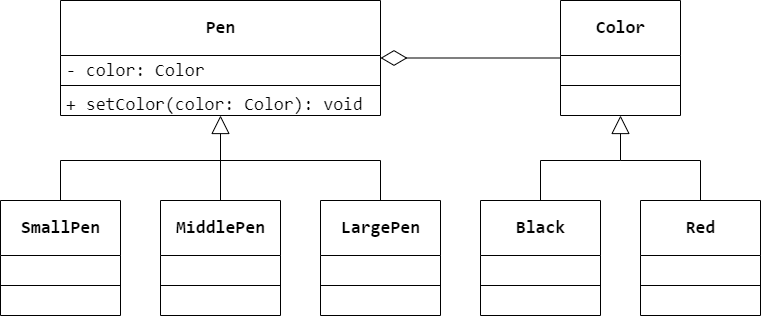

### 第 2 章　面向对象设计原则
1.　开闭原则是面向对象的可复用设计的基石，开闭原则是指一个软件实体应当对（$① \ B$）开放，对（$② \ A$）关闭；里氏代换原则是指任何（$③ \ C$）可以出现的地方，（$④ \ D$）一定可以出现；依赖倒转原则就是要依赖于（$⑤ \ D$），而不依赖于（$⑥ \ C$），或者说要针对接口编程，不要针对实现编程。

$① \ A.$ 修改 $B.$ 扩展 $C.$ 分析 $D.$ 设计

$② \ A.$ 修改 $B.$ 扩展 $C.$ 分析 $D.$ 设计

$③ \ A.$ 变量 $B.$ 常量 $C.$ 基类对象 $D.$ 子类对象

$④ \ A.$ 变量 $B.$ 常量 $C.$ 基类对象 $D.$ 子类对象

$⑤ \ A.$ 程序设计语言 $B.$ 建模语言 $C.$ 实现 $D.$ 抽象

$⑥ \ A.$ 程序设计语言 $B.$ 建模语言 $C.$ 实现 $D.$ 抽象

<br/>

2.　关于单一职责原则，以下叙述错误的是（$C$）。

$A.$ 一个类只负责一个功能领域中的相应职责

$B.$ 就一个类而言，应该有且仅有一个引起它变化的原因

$C.$ 一个类承担的职责越多，越容易复用，被复用的可能性越大

$D.$ 一个类承担的职责过多时需要将职责进行分离，将不同的职责封装在不同的类中

<br/>

3.　以下关于面向对象设计的叙述中错误的是（$D$）。

$A.$ 高层模块不应该依赖于底层模块

$B.$ 抽象不应该依赖于细节

$C.$ 细节可以依赖于抽象

$D.$ 高层模块无法不依赖于底层模块

<br/>

4.　在系统设计中应用迪米特法则,以下叙述有误的是（$D$）。

$A.$ 在类的划分上应该尽量创建松耦合的类，类的耦合度越低，复用越容易

$B.$ 如果两个类之间不必彼此直接通信，那么在这两个类就不应当发生直接的相互作用

$C.$ 在对其他类的引用上，一个对象对其他对象的引用应当降低到最低

$D.$ 在类的设计上，只要有可能，一个类型应该尽量设计成抽象类或接口，且成员变量和成员函数的访问权限最好设置成公开的（public）

<br/>

5.　有人将面向对象设计原则简单地归为 3 条：$①$ 封装变化点；$②$ 对接口进行编程；$③$ 多使用组合，而不是继承。请查阅相关资料并结合本章所学内容谈谈对这 3 条原则的理解。

“封装变化点”可对应“开闭原则”，“对接口进行编程”可对应“依赖倒转原则”，“多使用组合，而不是继承”可对应“合成复用原则”。

<br/>

6.　结合本章所学的面向对象设计原则谈谈对类和接口“粒度”的理解。

类的粒度需满足单一职责原则，接口的粒度需满足接口隔离原则。

<br/>

7.　结合面向对象设计原则分析正方形是否为长方形的子类？

```Java
public class Rectangle {
    private Double width;
    private Double height;
    public Rectangle() {

    }
    public Rectangle(Double width, Double height) {
        this.width = width;
        this.height = height;
    }
    public Double getWidth() {
        return width;
    }
    public void setWidth(Double width) {
        this.width = width;
    }
    public Double getHeight() {
        return height;
    }
    public void setHeight(Double height) {
        this.height = height;
    }
}
```

```Java
public class Square extends Rectangle {
    public Square() {

    }
    public Square(Double size) {
        super(size, size);
    }
    public void setWidth(Double width) {
        super.setWidth(width);
        super.setHeight(width);
    }
    public void setHeight(Double height) {
        super.setHeight(height);
        super.setWidth(height);
    }
}
```

```Java
public class Client {
    public static double calculateArea(Rectangle rectangle) {
        return rectangle.getWidth() * rectangle.getHeight();
    }
    public static void main(String[] args) {
        Rectangle rectangle = new Square();
        rectangle.setWidth(5.0);
        rectangle.setWidth(10.0);
        double area = calculateArea(rectangle);
        if (area == 50.0) {
            System.out.println("这是长方形或长方形的子类");
        }
        else {
            System.out.println("这不是长方形");
        }
    }
}
```

由代码输出可以得知，在客户端代码中使用长方形类来定义正方形对象，将输出“这不是长方形”，即将正方形作为长方形的子类，在使用正方形替换长方形之后正方形已经不再是长方形，接受基类对象的地方接受子类对象时出现问题，违反了里氏代换原则，因此从面向对象的角度分析，正方形不是长方形的子类，它们都可以作为四边形类的子类。

<br/>

8.　在某绘图软件中提供了多种大小不同的画笔（`Pen`），并且可以给画笔指定不同的颜色，某设计人员针对画笔的结构设计了如图 2-11 所示的初始类图。通过仔细分析，设计人员发现该类图存在非常严重的问题，如果需要增加一种新的大小的笔或者增加一种新的颜色，都需要增加很多子类。例如增加一种绿色，则对应每一种大小的笔都需要增加一支绿色笔，系统中的类的个数急剧增加。试根据依赖倒转原则和合成复用原则对该设计方案进行重构，使得增加新的大小的笔和增加新的颜色都较为方便。



在本重构方案中，将笔的大小和颜色设计为两个继承结构，两者可以独立变化，根据依赖倒转原则，建立一个抽象的关联关系，将颜色对象注入到画笔中；再根据合成复用原则，画笔在保持原有方法的同时还可以调用颜色类的方法，保持原有性质不变。如果需要增加一种新的画笔或增加一种新的颜色，只需对应增加一个具体类即可，且客户端可以针对高层类 `Pen` 和 `Color` 编程，在运行时再注入具体的子类对象，系统具有良好的可扩展性，满足开闭原则。（注：本重构方案即为桥接模式）