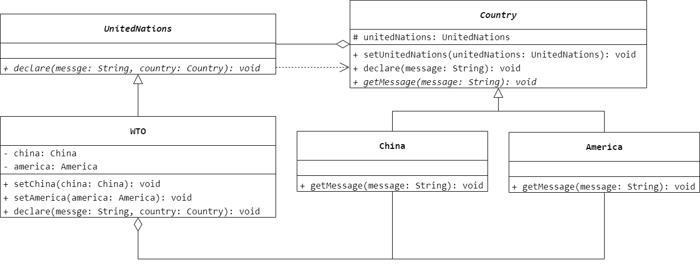
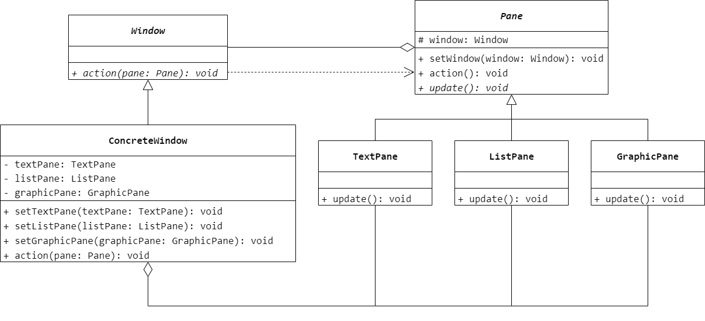
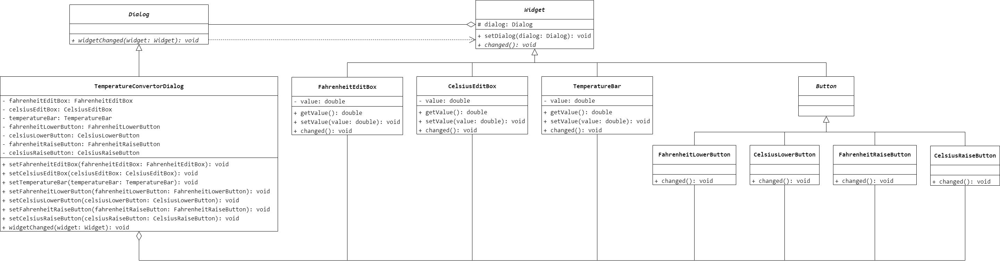

### 第 20 章　中介者模式
1.　在图形界面系统开发中，如果界面组件之间存在较为复杂的相互调用关系，为了降低界面组件之间的耦合度，让它们不产生直接的相互引用，可以使用（$C$）设计模式。

$A.$ 组合（Composite）

$B.$ 适配器（Adapter）

$C.$ 中介者（Mediator）

$D.$ 状态（State）

<br/>

2.　在中介者模式中通过中介者将同事类解耦，这是（$A$）的具体应用。

$A.$ 迪米特法则

$B.$ 接口隔离原则

$C.$ 里氏代换原则

$D.$ 合成复用原则

<br/>

3.　以下关于中介者模式的叙述错误的是（$B$）。

$A.$ 中介者模式用一个中介对象来封装一系列的对象交互

$B.$ 中介者模式和观察者模式均可以用于降低系统的耦合度，中介者模式用于处理对象之间一对多的调用关系，而观察者模式用于处理多对多的调用关系

$C.$ 中介者模式简化了对象之间的交互，将原本难以理解的网状结构转换成相对简单的星形结构

$D.$ 中介者将原本分布于多个对象间的行为集中在一起，改变这些行为只需要生成新的中介者子类即可，这使各个同事类可被重用

<br/>

4.　使用中介者模式来说明联合国的作用，要求绘制相应的类图并分析每个类的作用（注：可以将联合国定义为抽象中介者类，联合国下属机构（如 `WTO`、`WHO` 等）作为具体中介者类，国家作为抽象同事类，而将中国、美国等国家作为具体同事类）。



```Java
public abstract class Country {
    protected UnitedNations unitedNations;
    public UnitedNations getUnitedNations() {
        return unitedNations;
    }
    public void declare(String message) {
        unitedNations.declare(message, this);
    }
    public abstract void getMessage(String message);
}
```

```Java
public class China extends Country {
    @Override
    public void getMessage(String message) {

    }
}
```

```Java
public class America extends Country {
    @Override
    public void getMessage(String message) {

    }
}
```

```Java
public abstract class UnitedNations {
    public abstract void declare(String message, Country country);
}
```

```Java
public class WTO extends UnitedNations {
    private China china;
    private America america;
    public void setChina(China china) {
        this.china = china;
    }
    public void setAmerica(America america) {
        this.america = america;
    }
    @Override
    public void declare(String message, Country country) {
        if (country == china) {
            america.getMessage(message);
        }
        else if (country == america) {
            china.getMessage(message);
        }
    }
}
```

<br/>

5.　某软件公司要开发一套图形界面类库。该类库需要包含若干预定义的窗格（`Pane`）对象，例如 `TextPane`、`ListPane`、`GraphicPane` 等，窗格之间不允许直接引用。基于该类库的应用由一个包含一组窗格的窗口（`Window`）组成，窗口需要协调窗格之间的行为。试采用中介者模式设计该系统，要求绘制相应的类图并使用 Java 语言编程模拟实现。



```Java
public abstract class Pane {
    protected Window window;
    public void setWindow(Window window) {
        this.window = window;
    }
    public void action() {
        window.action(this);
    }
    public abstract void update();
}
```

```Java
public class TextPane extends Pane {
    @Override
    public void update() {

    }
}
```

```Java
public class ListPane extends Pane{
    @Override
    public void update() {

    }
}
```

```Java
public class GraphicPane extends Pane{
    @Override
    public void update() {

    }
}
```

```Java
public abstract class Window {
    public abstract void action(Pane pane);
}
```

```Java
public class ConcreteWindow extends Window {
    private TextPane textPane;
    private ListPane listPane;
    private GraphicPane graphicPane;
    public void setTextPane(TextPane textPane) {
        this.textPane = textPane;
    }
    public void setListPane(ListPane listPane) {
        this.listPane = listPane;
    }
    public void setGraphicPane(GraphicPane graphicPane) {
        this.graphicPane = graphicPane;
    }
    @Override
    public void action(Pane pane) {
        if (pane == textPane) {
            listPane.update();
            graphicPane.update();
        }
        else if (pane == listPane) {
            textPane.update();
            graphicPane.update();
        }
        else if (pane == graphicPane) {
            textPane.update();
            listPane.update();
        }
    }
}
```

<br/>

6.　有如图 20-11 所示的温度转换器程序，该程序在同一个界面上显示华氏温度（`Fahrenheit`）和摄氏温度（`Celsius`）。用户可以通过“升高”“降低”按钮或右边的温度调节条来调节温度，也可以直接通过文本框来设置温度，摄氏温度和华氏温度将同时改变，且温度调节条将一起被调节。使用中介者模式设计该系统，绘制类图并使用 Java 语言编程模拟实现。



```Java
public abstract class Widget {
    protected Dialog dialog;
    public void setDialog(Dialog dialog) {
        this.dialog = dialog;
    }
    public abstract void changed();
}
```

```Java
public class FahrenheitEditBox extends Widget {
    private double value;
    public double getValue() {
        return value;
    }
    public void setValue(double value) {
        this.value = value;
    }
    @Override
    public void changed() {
        dialog.widgetChanged(this);
    }
}
```

```Java
public class CelsiusEditBox extends Widget {
    private double value;
    public double getValue() {
        return value;
    }
    public void setValue(double value) {
        this.value = value;
    }
    @Override
    public void changed() {
        dialog.widgetChanged(this);
    }
}
```

```Java
public class TemperatureBar extends Widget {
    private double value;
    public double getValue() {
        return value;
    }
    public void setValue(double value) {
        this.value = value;
    }
    @Override
    public void changed() {
        dialog.widgetChanged(this);
    }
}
```

```Java
public abstract class Button extends Widget {

}
```

```Java
public class FahrenheitLowerButton extends Button {
    @Override
    public void changed() {
        dialog.widgetChanged(this);
    }
}
```

```Java
public class CelsiusLowerButton extends Button {
    @Override
    public void changed() {
        dialog.widgetChanged(this);
    }
}
```

```Java
public class FahrenheitRaiseButton extends Button {
    @Override
    public void changed() {
        dialog.widgetChanged(this);
    }
}
```

```Java
public class CelsiusRaiseButton extends Button {
    @Override
    public void changed() {
        dialog.widgetChanged(this);
    }
}
```

```Java
public abstract class Dialog {
    public abstract void widgetChanged(Widget widget);
}
```

```Java
public class TemperatureConvertorDialog extends Dialog {
    private FahrenheitEditBox fahrenheitEditBox;
    private CelsiusEditBox celsiusEditBox;
    private TemperatureBar temperatureBar;
    private FahrenheitLowerButton fahrenheitLowerButton;
    private CelsiusLowerButton celsiusLowerButton;
    private FahrenheitRaiseButton fahrenheitRaiseButton;
    private CelsiusRaiseButton celsiusRaiseButton;
    public void setFahrenheitEditBox(FahrenheitEditBox fahrenheitEditBox) {
        this.fahrenheitEditBox = fahrenheitEditBox;
    }
    public void setCelsiusEditBox(CelsiusEditBox celsiusEditBox) {
        this.celsiusEditBox = celsiusEditBox;
    }
    public void setTemperatureBar(TemperatureBar temperatureBar) {
        this.temperatureBar = temperatureBar;
    }
    public void setFahrenheitLowerButton(FahrenheitLowerButton fahrenheitLowerButton) {
        this.fahrenheitLowerButton = fahrenheitLowerButton;
    }
    public void setCelsiusLowerButton(CelsiusLowerButton celsiusLowerButton) {
        this.celsiusLowerButton = celsiusLowerButton;
    }
    public void setFahrenheitRaiseButton(FahrenheitRaiseButton fahrenheitRaiseButton) {
        this.fahrenheitRaiseButton = fahrenheitRaiseButton;
    }
    public void setCelsiusRaiseButton(CelsiusRaiseButton celsiusRaiseButton) {
        this.celsiusRaiseButton = celsiusRaiseButton;
    }
    @Override
    public void widgetChanged(Widget widget) {
        if (widget == fahrenheitEditBox) {

        }
        else if (widget == celsiusEditBox) {

        }
        else if (widget == temperatureBar) {

        }
        else if (widget == fahrenheitLowerButton) {

        }
        else if (widget == celsiusLowerButton) {

        }
        else if (widget == fahrenheitRaiseButton) {

        }
        else if (widget == celsiusRaiseButton) {

        }
    }
}
```