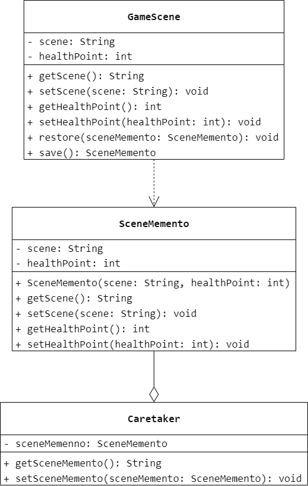

### 第 21 章　备忘录模式
1.　很多软件都提供了撤销功能，（$B$）设计模式可以用于实现该功能。

$A.$ 中介者

$B.$ 备忘录

$C.$ 迭代器

$D.$ 观察者

<br/>

2.　以下关于备忘录模式的叙述的错误的是（$D$）。

$A.$ 备忘录模式的作用是在不破坏封装的前提下捕获一个对象的内部状态，并在该对象之外保存这个状态，这样可以在以后将对象恢复到原先保存的状态

$B.$ 备忘录模式提供了一种状态恢复的实现机制，使得用户可以方便地回到一个特定的历史步骤

$C.$ 备忘录模式的缺点在于资源消耗太大，如果类的成员变量太多，就不可避免地占用大量的内存，而且每保存一次对象的状态都需要消耗内存资源

$D.$ 备忘录模式属于对象行为型模式，负责人向原发器请求一个备忘录，保留一段时间后将其送回给负责人，负责人负责对备忘录的内容进行操作和检查

<br/>

3.　能否使用原型模式来创建备忘录对象？如果可以，如何实现？

可以使用原型模式来创建备忘录模式。在创建备忘录时可以通过克隆原发器对象来实现，
即使用原型模式，此时原发器需要支持自我复制。为了简化系统设计，可以将原发器和备忘录合并，直接将克隆生成的原发器对象保存在负责人中。引入原型模式的原发器类的 Java 代码如下所示：

```Java
public class Originator implements Cloneable, Serializable {
    private String state;
    public Originator() {

    }
    public String getState() {
        return state;
    }
    public void setState(String state) {
        this.state = state;
    }
    public Originator cloneMemento() throws CloneNotSupportedException {
        return (Originator) clone();
    }
    public Originator deepCloneMemento() throws Exception {
        ByteArrayOutputStream baos = new ByteArrayOutputStream();
        ObjectOutputStream oos = new ObjectOutputStream(baos);
        oos.writeObject(this);
        ByteArrayInputStream bais = new ByteArrayInputStream(baos.toByteArray());
        ObjectInputStream ois = new ObjectInputStream(bais);
        return (Originator) ois.readObject();
    }
    public void restoreMemento(Originator originator) {
        state = originator.getState();
    }
}
```

<br/>

4.　如何使用内部类来实现备忘录模式？试使用 Java 语言结合内部类来实现一个简单的备忘录模式。

```Java
public interface IMemento {

}
```

```Java
public class Originator {
    private static class Memento implements IMemento {
        private String savedState;
        private Memento(String state) {
            savedState = state;
        }
        private String getState() {
            return savedState;
        }
        private void setState(String state) {
            savedState = state;
        }
    }
    private String state;
    public Originator() {

    }
    public String getState() {
        return this.state;
    }
    public void setState(String state) {
        this.state = state;
    }
    public IMemento createMemento() {
        return new Memento(state);
    }
    public void restoreMemento(IMemento memento) {
        this.setState(((Memento) memento).getState());
    }
}
```

<br/>

5.　使用 Java 语言中的栈（`Stack`）来实现多次撤销和重做（恢复）操作。在实现时可以将备忘录对象保存在两个栈中，一个栈包含用于实现撤销操作的状态对象，另一个包含用于实现重做操作的状态对象。在实现撤销操作时弹出撤销栈栈顶对象以获取前一个状态并将其设置给应用程序；同样，在实现重做操作时弹出重做栈栈顶对象以获取下一个状态并将其设置给应用程序。

略。

<br/>

6.　某软件公司正在开发一款 RPG 网游，为了给玩家提供更多方便，在游戏过程中可以设置一个恢复点，用于保存当前的游戏场景，如果在后续游戏过程中玩家角色“不幸牺牲”，可以返回到先前保存的场景，从所设恢复点开始重新游戏。试使用备忘录模式设计该功能，要求绘制相应的类图并使用 Java 语言编程模拟实现。



```Java
public class GameScene {
    private String scene;
    private int healthPoint;
    public String getScene() {
        return scene;
    }
    public void setScene(String scene) {
        this.scene = scene;
    }
    public int getHealthPoint() {
        return healthPoint;
    }
    public void setHealthPoint(int healthPoint) {
        this.healthPoint = healthPoint;
    }
    public void restore(SceneMemento sceneMemento) {
        scene = sceneMemento.getScene();
        healthPoint = sceneMemento.getHealthPoint();
    }
    public SceneMemento save() {
        return new SceneMemento(scene, healthPoint);
    }
}
```

```Java
public class SceneMemento {
    private String scene;
    private int healthPoint;
    public SceneMemento(String scene, int healthPoint) {
        this.scene = scene;
        this.healthPoint = healthPoint;
    }
    public String getScene() {
        return scene;
    }
    public void setScene(String scene) {
        this.scene = scene;
    }
    public int getHealthPoint() {
        return healthPoint;
    }
    public void setHealthPoint(int healthPoint) {
        this.healthPoint = healthPoint;
    }
}
```

```Java
public class Caretaker {
    private SceneMemento sceneMemento;
    public SceneMemento getSceneMemento() {
        return sceneMemento;
    }
    public void setSceneMemento(SceneMemento sceneMemento) {
        this.sceneMemento = sceneMemento;
    }
}
```