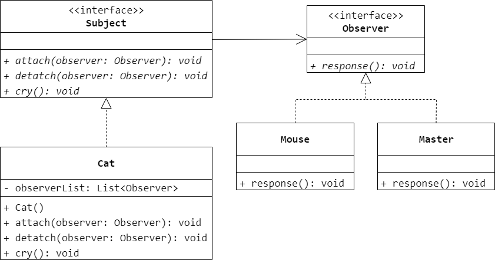
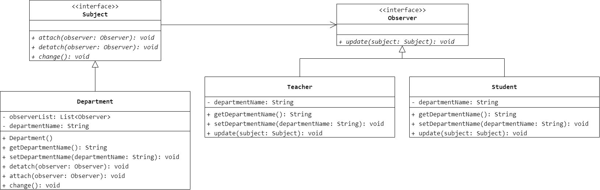
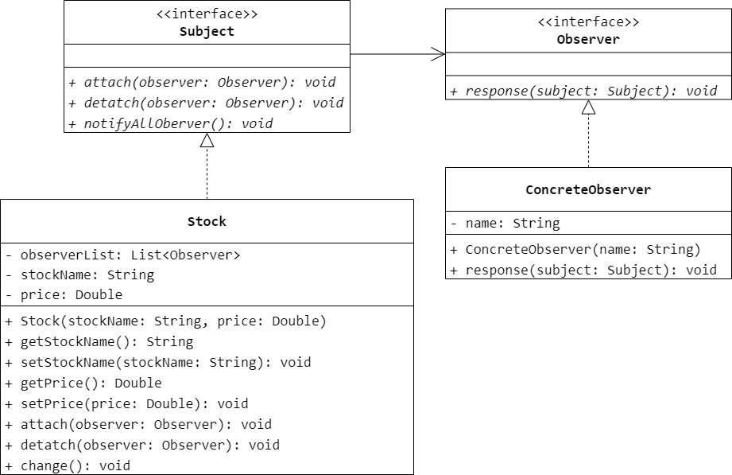

### 第 22 章　观察者模式
1.　（$D$）设计模式定义了对象间的一种一对多的依赖关系，以便当一个对象的状态发生改变时所有依赖于它的对象都得到通知并自动刷新。

$A.$ Adapter（适配器）

$B.$ Iterator（迭代器）

$C.$ Prototype（原型）

$D.$ Observer（观察者）

<br/>

2.　在观察者模式中，（$A$）。

$A.$ 一个 `Subject` 对象可对应多个 `Observer` 对象

$B.$ `Subject` 只能有一个 `ConcreteSubject` 子类

$C.$ `Observer` 只能有一个 `ConcreteObserver` 子类

$D.$ 一个 `Subject` 对象必须至少对应一个 `Observer` 对象

<br/>

3.　下面这句话隐含着（$C$）设计模式。我和妹妹跟妈妈说：“妈妈，我和妹妹在院子里玩。饭做好了叫我们一声。”

$A.$ 适配器

$B.$ 职责链

$C.$ 观察者

$D.$ 迭代器

<br/>

4.　“猫（`Cat`）大叫一声，老鼠（`Mouse`）开始逃跑，主人（`Master`）被惊醒”。这个过程蕴含了哪种设计模式，绘制相应的类图并使用 Java 语言编程模拟此过程。



```Java
public interface Observer {
    void response();
}
```

```Java
public class Mouse implements Observer {
    @Override
    public void response() {

    }
}
```

```Java
public class Master implements Observer {
    @Override
    public void response() {

    }
}
```

```Java
public interface Subject {
    void attach(Observer observer);
    void detach(Observer observer);
    void cry();
}
```

```Java
public class Cat implements Subject {
    private List<Observer> observerList;
    public Cat() {
        observerList = new ArrayList<>();
    }
    @Override
    public void attach(Observer observer) {
        observerList.add(observer);
    }
    @Override
    public void detach(Observer observer) {
        observerList.remove(observer);
    }
    @Override
    public void cry() {
        for (int i = 0; i < observerList.size(); i++) {
            observerList.get(i).response();
        }
    }
}
```

<br/>

5.　某高校教学管理系统需要实现以下功能：如果某个系的系名发生改变，则该系所有教师和学生的所属系名称也将发生改变。试使用观察者模式实现该功能，要求绘制相应的类图并使用 Java 语言编程实现。



```Java
public interface Observer {
    void update(Subject subject);
}
```

```Java
public class Teacher implements Observer {
    private String departmentName;
    public String getDepartmentName() {
        return departmentName;
    }
    public void setDepartmentName(String departmentName) {
        this.departmentName = departmentName;
    }
    @Override
    public void update(Subject subject) {
        departmentName = ((Department) subject).getDepartmentName();
    }
}
```

```Java
public class Student implements Observer {
    private String departmentName;
    public String getDepartmentName() {
        return departmentName;
    }
    public void setDepartmentName(String departmentName) {
        this.departmentName = departmentName;
    }
    @Override
    public void update(Subject subject) {
        departmentName = ((Department) subject).getDepartmentName();
    }
}
```

```Java
public interface Subject {
    void attach(Observer observer);
    void detach(Observer observer);
    void change();
}
```

```Java
public class Department implements Subject {
    private List<Observer> observerList;
    private String departmentName;
    public Department() {
        observerList = new ArrayList<>();
    }
    public String getDepartmentName() {
        return departmentName;
    }
    public void setDepartmentName(String departmentName) {
        this.departmentName = departmentName;
        change();
    }
    @Override
    public void attach(Observer observer) {
        observerList.add(observer);
    }
    @Override
    public void detach(Observer observer) {
        observerList.remove(observer);
    }
    @Override
    public void change() {
        for (int i = 0; i < observerList.size(); i++) {
            observerList.get(i).update(this);
        }
    }
}
```

<br/>

6.　某实时在线股票软件需要提供以下功能：当股票购买者所购买的某支股票的价格变化幅度达到 5% 时，系统将自动发送通知（包括新价格）给购买该股票的所有股民。试使用观察者模式设计并实现该系统，要求绘制相应的类图并使用 Java 语言编程模拟实现。



```Java
public interface Observer {
    void response(Subject subject);
}
```

```Java
public class ConcreteObserver implements Observer {
    private String name;
    public ConcreteObserver(String name) {
        this.name = name;
    }
    @Override
    public void response(Subject subject) {

    }
}
```

```Java
public interface Subject {
    void attach(Observer observer);
    void detach(Observer observer);
    void notifyAllObserver();
}
```

```Java
public class Stock implements Subject {
    private List<Observer> observerList;
    private String stockName;
    private Double price;
    public Stock(String stockName, Double price) {
        observerList = new ArrayList<>();
        this.stockName = stockName;
        this.price = price;
    }
    public String getStockName() {
        return stockName;
    }
    public void setStockName(String stockName) {
        this.stockName = stockName;
    }
    public Double getPrice() {
        return price;
    }
    public void setPrice(Double price) {
        double range = Math.abs(price - this.price) / this.price;
        this.price = price;
        if (range >= 0.05) {
            notifyAllObserver();
        }
    }
    @Override
    public void attach(Observer observer) {
        observerList.add(observer);
    }
    @Override
    public void detach(Observer observer) {
        observerList.remove(observer);
    }
    @Override
    public void notifyAllObserver() {
        for (int i = 0; i < observerList.size(); i++) {
            observerList.get(i).response(this);
        }
    }
}
```

<br/>

7.　编程实现图 22-6 所示的自定义登录组件。

略。