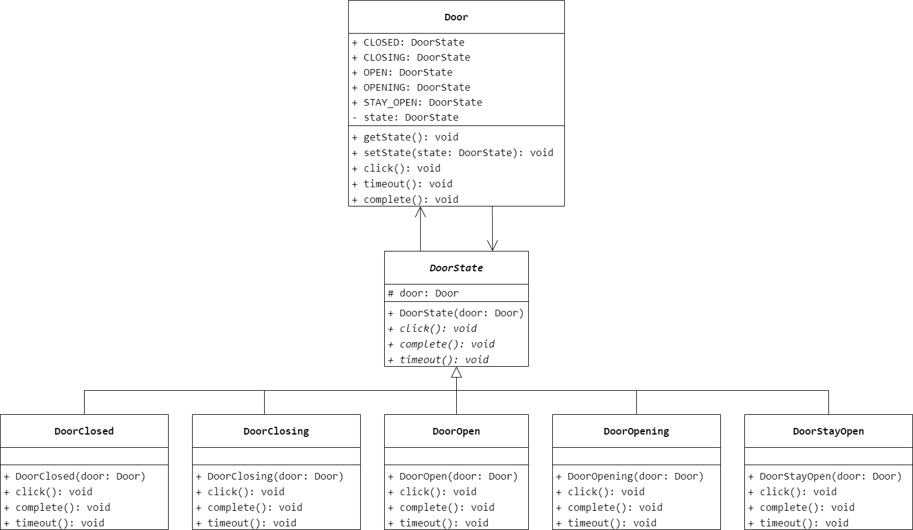
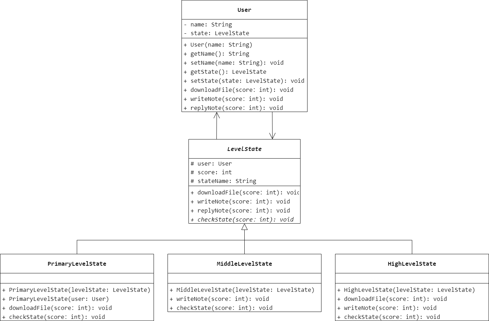
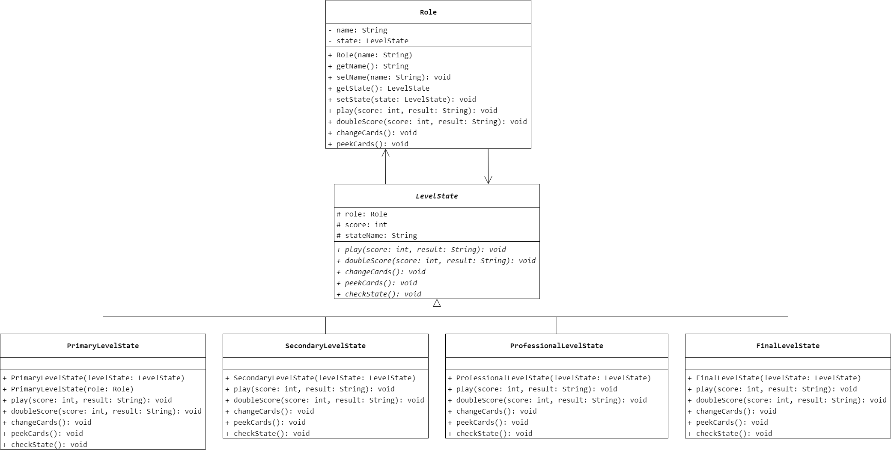

### 第 23 章　状态模式
1.　以下关于状态模式的叙述错误的是（$D$）。

$A.$ 状态模式允许一个对象在其内部状态改变时改变它的行为。对象看起来似乎修改了它的类

$B.$ 状态模式中引入了一个抽象类来专门表示对象的状态，而具体的状态都继承了该类，并实现了不同状态的行为，包括各种状态之间的转换

$C.$ 状态模式使得状态的变化更加清晰明了，也很容易创建对象的新状态

$D.$ 状态模式完全符合开闭原则，增加新的状态类无须对原有类库进行任何修改

<br/>

2.　场景（$C$）不是状态模式的实例。

$A.$ 银行账户根据余额不同拥有不同的存/取款操作

$B.$ 游戏软件中根据虚拟角色级别的不同拥有不同的权限

$C.$ 某软件在不同的操作系统中呈现不同的外观

$D.$ 在会员系统中会员等级不同可以实现不同的行为

<br/>

3.　分析以下代码：为了提高代码的扩展性和健壮性，可以使用（$D$）设计模式进行重构。

```Java
public class TestXYZ {
    private int behaviour;
    //Getter and Setter
    //...
    public void handleAll() {
        if (behaviour == 0) {
            //do something
        }
        else if (behaviour == 1) {
            //do something
        }
        else if (behaviour == 2) {
            //do something
        }
        else if (behaviour == 3) {
            //do something
        }
        //... some more else if ...
    }
}
```

$A.$ Visitor（访问者）

$B.$ Facade（外观）

$C.$ Memento（备忘录）

$D.$ State（状态）

<br/>

4.　传输门是传输系统中的重要装置。传输门具有 `Open`（打开）、`Closed`（关闭）、`Opening`（正在打开）、`StayOpen`（保持打开）、`Closing`（正在关闭）5 种状态。触发状态的转换事件有 `click`、`complete` 和 `timeout` 几种。事件与其相应的状态转换如图 23-7 所示。试使用状态模式对传输门进行状态模拟，要求绘制相应的类图并使用 Java 语言编程模拟实现。



```Java
public abstract class DoorState {
    protected Door door;
    public DoorState(Door door) {
        this.door = door;
    }
    public abstract void click();
    public abstract void complete();
    public abstract void timeout();
}
```

```Java
public class DoorClosed extends DoorState {
    public DoorClosed(Door door) {
        super(door);
    }
    public void click() {
        door.setState(door.OPENING);
    }
    @Override
    public void complete() {
        door.setState(door.CLOSING);
    }
    @Override
    public void timeout() {

    }
}
```

```Java
public class DoorClosing extends DoorState {
    public DoorClosing(Door door) {
        super(door);
    }
    @Override
    public void click() {
        door.setState(door.OPENING);
    }
    @Override
    public void complete() {
        door.setState(door.CLOSED);
    }
    @Override
    public void timeout() {

    }
}
```

```Java
public class DoorOpen extends DoorState {
    public DoorOpen(Door door) {
        super(door);
    }
    @Override
    public void click() {
        door.setState(door.STAY_OPEN);
    }
    @Override
    public void complete() {

    }
    @Override
    public void timeout() {
        door.setState(door.CLOSING);
    }
}
```

```Java
public class DoorOpening extends DoorState {
    public DoorOpening(Door door) {
        super(door);
    }
    @Override
    public void click() {
        door.setState(door.CLOSING);
    }
    @Override
    public void complete() {
        door.setState(door.OPEN);
    }
    @Override
    public void timeout() {

    }
}
```

```Java
public class DoorStayOpen extends DoorState {
    public DoorStayOpen(Door door) {
        super(door);
    }
    @Override
    public void click() {
        door.setState(door.CLOSING);
    }
    @Override
    public void complete() {

    }
    @Override
    public void timeout() {

    }
}
```

```Java
public class Door {
    public final DoorState CLOSED = new DoorClosed(this);
    public final DoorState CLOSING = new DoorClosing(this);
    public final DoorState OPEN = new DoorOpen(this);
    public final DoorState OPENING = new DoorOpening(this);
    public final DoorState STAY_OPEN = new DoorStayOpen(this);
    private DoorState state = CLOSED;
    public DoorState getState() {
        return state;
    }
    public void setState(DoorState state) {
        this.state = state;
    }
    public void click() {
        state.click();
    }
    public void timeout() {
        state.timeout();
    }
    public void complete() {
        state.complete();
    }
}
```

<br/>

5.　在某论坛系统中用户可以发表留言，发表留言将增加积分；用户也可以回复留言，回复留言也将增加积分；用户还可以下载文件，下载文件将扣除积分。该系统用户分为 3 个等级，分别是新手、高手和专家，这 3 个等级对应 3 种不同的状态，这 3 种状态分别定义如下：（1）如果积分小于 100 分，则为新手状态，用户可以发表留言、回复留言，但是不能下载文件。如果积分大于等于 1000 分，则转换为专家状态；如果积分大于等于 100 分，则转换为高手状态。（2）如果积分大于等于 100 分但小于 1000 分，则为高手状态，用户可以发表留言、回复留言，还可以下载文件，而且用户在发表留言时可以获取双倍积分。如果积分小于 100 分，则转换为新手状态；如果积分大于等于 1000 分，则转换为专家状态；如果下载文件后积分小于 0，则不能下载该文件。（3）如果积分大于等于 1000 分，则为专家状态，用户可以发表留言、回复留言和下载文件，用户除了在发表留言时可以获取双倍积分外，下载文件只扣除所需积分的一半。如果积分小于 100 分，则转换为新手状态；如果积分小于 1000 分，但大于等于 100，则转换为高手状态；如果下载文件后积分小于 0，则不能下载该文件。试使用状态模式来设计该系统，要求绘制相应的类图并使用 Java 语言编程模拟实现。



```Java
public abstract class LevelState {
    protected User user;
    protected int score;
    protected String stateName;
    public void downloadFile(int score) {
        this.score -= score;
        checkState(score);
    }
    public void writeNote(int score) {
        this.score += score;
        checkState(score);
    }
    public void replyNote(int score) {
        this.score += score;
        checkState(score);
    }
    public abstract void checkState(int score);
}
```

```Java
public class PrimaryLevelState extends LevelState {
    public PrimaryLevelState(LevelState levelState) {
        user = levelState.user;
        score = levelState.score;
        stateName = "新手";
    }
    public PrimaryLevelState(User user) {
        this.user = user;
        score = 0;
        stateName = "新手";
    }
    @Override
    public void downloadFile(int score) {

    }
    @Override
    public void checkState(int score) {
        if (this.score < 0) {
            this.score += score;
        }
        else if (this.score >= 1000) {
            user.setState(new HighLevelState(this));
        }
        else if (this.score >= 100) {
            user.setState(new MiddleLevelState(this));
        }
    }
}
```

```Java
public class MiddleLevelState extends LevelState {
    public MiddleLevelState(LevelState levelState) {
        user = levelState.user;
        score = levelState.score;
        stateName = "高手";
    }
    @Override
    public void writeNote(int score) {
        this.score += 2 * score;
        checkState(score);
    }
    @Override
    public void checkState(int score) {
        if (this.score < 0) {
            this.score += score;
        }
        else if (this.score >= 1000) {
            user.setState(new HighLevelState(this));
        }
        else if (this.score <= 100) {
            user.setState(new PrimaryLevelState(this));
        }
    }
}
```

```Java
public class HighLevelState extends LevelState {
    public HighLevelState(LevelState levelState) {
        user = levelState.user;
        score = levelState.score;
        stateName = "专家";
    }
    @Override
    public void downloadFile(int score) {
        this.score -= score / 2;
        checkState(score);
    }
    @Override
    public void writeNote(int score) {
        this.score += 2 * score;
        checkState(score);
    }
    @Override
    public void checkState(int score) {
        if (this.score < 0) {
            this.score += score;
        }
        else if (this.score <= 100) {
            user.setState(new PrimaryLevelState(this));
        }
        else if (this.score <= 1000) {
            user.setState(new MiddleLevelState(this));
        }
    }
}
```

```Java
public class User {
    private String name;
    private LevelState state;
    public User(String name) {
        this.name = name;
        this.state = new PrimaryLevelState(this);
    }
    public String getName() {
        return name;
    }
    public void setName(String name) {
        this.name = name;
    }
    public LevelState getState() {
        return state;
    }
    public void setState(LevelState state) {
        this.state = state;
    }
    public void downloadFile(int score) {
        state.downloadFile(score);
    }
    public void writeNote(int score) {
        state.writeNote(score);
    }
    public void replyNote(int score) {
        state.replyNote(score);
    }
}
```

<br/>

6.　在某纸牌游戏软件中人物角色具有入门级（`Primary`）、熟练级（`Secondary`）、高手级（`Professional`）和骨灰级（`Final`）4 种等级，角色的等级与其积分相对应，游戏胜利将增加积分，失败则扣除积分。入门级具有最基本的游戏功能 `play()`，熟练级增加了游戏胜利积分加倍功能 `doubleScore()`，高手级在熟练级的基础上再增加换牌功能 `changeCards()`，骨灰级在高手级的基础上再增加偷看他人牌的功能 `peekCards()`。试使用状态模式来设计该系统，绘制相应的类图并使用 Java 语言编程模拟实现。



```Java
public abstract class LevelState {
    protected Role role;
    protected int score;
    protected String stateName;
    public abstract void play(int score, String result);
    public abstract void doubleScore(int score, String result);
    public abstract void changeCards();
    public abstract void peekCards();
    public abstract void checkState(int score);
}
```

```Java
public class PrimaryLevelState extends LevelState {
    public PrimaryLevelState(LevelState levelState) {
        role = levelState.role;
        score = levelState.score;
        stateName = "入门级";
    }
    public PrimaryLevelState(Role role) {
        this.role = role;
        score = 0;
        stateName = "入门级";
    }
    @Override
    public void play(int score, String result) {

    }
    @Override
    public void doubleScore(int score, String result) {

    }
    @Override
    public void changeCards() {

    }
    @Override
    public void peekCards() {

    }
    @Override
    public void checkState(int score) {

    }
}
```

```Java
public class SecondaryLevelState extends LevelState {
    public SecondaryLevelState(LevelState levelState) {
        role = levelState.role;
        score = levelState.score;
        stateName = "熟练级";
    }
    @Override
    public void play(int score, String result) {

    }
    @Override
    public void doubleScore(int score, String result) {

    }
    @Override
    public void changeCards() {

    }
    @Override
    public void peekCards() {

    }
    @Override
    public void checkState(int score) {

    }
}
```

```Java
public class ProfessionalLevelState extends LevelState {
    public ProfessionalLevelState(LevelState levelState) {
        role = levelState.role;
        score = levelState.score;
        stateName = "高手级";
    }
    @Override
    public void play(int score, String result) {

    }
    @Override
    public void doubleScore(int score, String result) {

    }
    @Override
    public void changeCards() {

    }
    @Override
    public void peekCards() {

    }
    @Override
    public void checkState(int score) {

    }
}
```

```Java
public class FinalLevelState extends LevelState {
    public FinalLevelState(LevelState levelState) {
        role = levelState.role;
        score = levelState.score;
        stateName = "骨灰级";
    }
    @Override
    public void play(int score, String result) {

    }
    @Override
    public void doubleScore(int score, String result) {

    }
    @Override
    public void changeCards() {

    }
    @Override
    public void peekCards() {

    }
    @Override
    public void checkState(int score) {

    }
}
```

```Java
public class Role {
    private String name;
    private LevelState state;
    public Role(String name) {
        this.name = name;
        this.state = new PrimaryLevelState(this);
    }
    public String getName() {
        return name;
    }
    public void setName(String name) {
        this.name = name;
    }
    public LevelState getState() {
        return state;
    }
    public void setState(LevelState state) {
        this.state = state;
    }
    public void play(int score, String result) {
        state.play(score, result);
    }
    public void doubleScore(int score, String result) {
        state.doubleScore(score, result);
    }
    public void changeCards() {
        state.changeCards();
    }
    public void peekCards() {
        state.peekCards();
    }
}
```