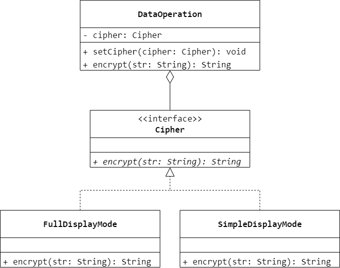
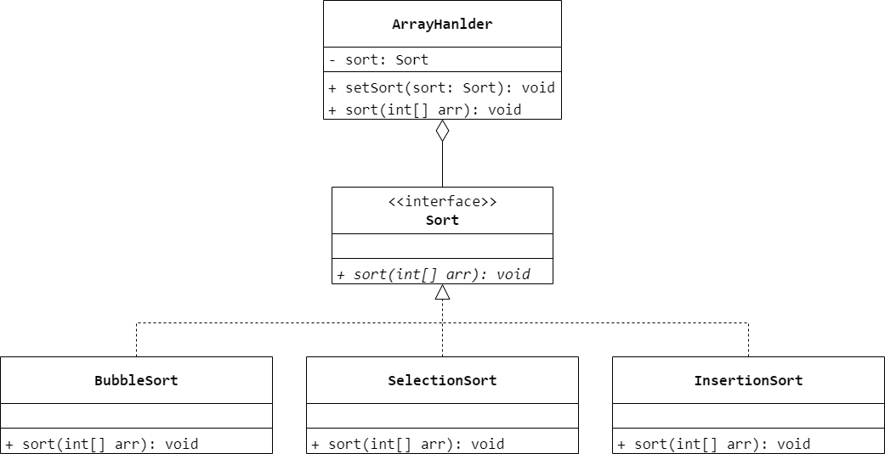
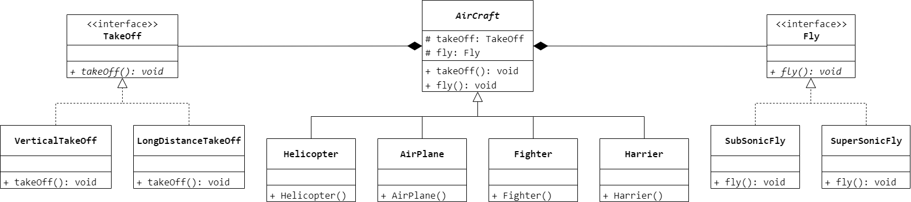

### 第 24 章　策略模式
1.　在某系统中用户可自行动态地选择某种排序算法（例如选择排序、冒泡排序、插入排序）来实现某功能，该系统的设计可以使用（$B$）设计模式。

$A.$ 状态

$B.$ 策略

$C.$ 模板方法

$D.$ 工厂方法

<br/>

2.　以下关于策略模式的叙述错误的是（$B$）。

$A.$ 策略模式是对算法的包装，它把算法的责任和算法本身分隔开，委派给不同的对象管理

$B.$ 在 `Context` 类中维护了所有 `ConcreteStrategy` 的引用实例

$C.$ 策略模式让算法独立于使用它的客户而变化

$D.$ 在策略模式中定义一系列算法，并将每一个算法封装起来，让它们可以相互替换

<br/>

3.　以下关于策略模式的优/缺点的描述错误的是（$A$）。

$A.$ 在策略模式中客户端无须知道所有的策略类，系统必须自行提供一个策略类

$B.$ 策略模式可以避免使用多重条件转移语句

$C.$ 策略模式会导致产生大量的策略类

$D.$ 策略模式提供了管理相关算法族的办法

<br/>

4.　在策略模式中一个环境类 `Context` 能否对应多个不同的策略等级结构？如何设计？

一个环境类可以对应多个不同的策略等级结构。在环境类中维持对每一个策略等级结构中抽象策略类的引用即可，在程序运行时再分别从每一个策略等级结构中选择一个具体策略对象注入到环境类中。

<br/>

5.　某系统需要对重要数据（如用户密码）进行加密，并提供了几种加密方案（例如凯撒加密、求模加密等），对该加密模块进行设计，使得用户可以动态地选择加密方式。要求绘制相应的类图并使用 Java 语言编程实现。



```Java
public interface Cipher {
    String encrypt(String str);
}
```

```Java
public class CaesarCipher implements Cipher {
    @Override
    public String encrypt(String str) {
        return str;
    }
}
```

```Java
public class ModCipher implements Cipher {
    @Override
    public String encrypt(String str) {
        return str;
    }
}
```

```Java
public class DataOperation {
    private Cipher cipher;
    public void setCipher(Cipher cipher) {
        this.cipher = cipher;
    }
    public String encrypt(String str) {
        return cipher.encrypt(str);
    }
}
```

<br/>

6.　某系统提供了一个用于对数组数据进行操作的类，该类封装了对数组的常见操作，如查找数组元素、对数组元素进行排序等。现以排序操作为例，使用策略模式设计该数组操作类，使得客户端可以动态地更换排序算法，可以根据需要选择冒泡排序或选择排序或插入排序，也能够灵活地增加新的排序算法。要求绘制相应的类图并使用 Java 语言编程实现。



```Java
public interface Sort {
    void sort(int[] arr);
}
```

```Java
public class BubbleSort implements Sort {
    @Override
    public void sort(int[] arr) {

    }
}
```

```Java
public class SelectionSort implements Sort {
    @Override
    public void sort(int[] arr) {

    }
}
```

```Java
public class InsertionSort implements Sort {
    @Override
    public void sort(int[] arr) {

    }
}
```

```Java
public class ArrayHandler {
    private Sort sort;
    public void setSort(Sort sort) {
        this.sort = sort;
    }
    public void sort(int[] arr) {
        sort.sort(arr);
    }
}
```

<br/>

7.　某软件公司要开发一款飞机模拟系统，该系统主要模拟不同种类飞机的飞行特征与起飞特征，需要模拟的飞机种类及其特征如表 24-1 所示。为了将来能够模拟更多种类的飞机，试采用策略模式设计该飞机模拟系统。

| 飞机种类 | 起飞特征 | 飞行特征 |
| - | - | - |
| 直升机（`Helicopter`） | 垂直起飞（`VerticalTakeOff`） | 亚音速飞行（`SubSonicFly`） |
| 客机（`AirPlane`） | 长距离起飞（`LongDistanceTakeOff`） | 亚音速飞行（`SubSonicFly`） |
| 歼击机（`Fighter`） | 长距离起飞（`LongDistanceTakeOff`） | 超音速飞行（`SuperSonicFly`） |
| 鹞式战斗机（`Harrier`） | 垂直起飞（`VerticalTakeOff`） | 超音速飞行（`SuperSonicFly`） |



```Java
public interface TakeOff {
    void takeOff();
}
```

```Java
public class VerticalTakeOff implements TakeOff {
    @Override
    public void takeOff() {

    }
}
```

```Java
public class LongDistanceTakeOff implements TakeOff {
    @Override
    public void takeOff() {

    }
}
```

```Java
public interface Fly {
    void fly();
}
```

```Java
public class SubSonicFly implements Fly {
    @Override
    public void fly() {

    }
}
```

```Java
public class SuperSonicFly implements Fly {
    @Override
    public void fly() {

    }
}
```

```Java
public abstract class AirCraft {
    protected TakeOff takeOff;
    protected Fly fly;
    public void fly() {
        fly.fly();
    }
    public void takeOff() {
        takeOff.takeOff();
    }
}
```

```Java
public class Helicopter extends AirCraft {
    public Helicopter() {
        takeOff = new VerticalTakeOff();
        fly = new SubSonicFly();
    }
}
```

```Java
public class AirPlane extends AirCraft {
    public AirPlane() {
        takeOff = new LongDistanceTakeOff();
        fly = new SubSonicFly();
    }
}
```

```Java
public class Fighter extends AirCraft {
    public Fighter() {
        takeOff = new LongDistanceTakeOff();
        fly = new SuperSonicFly();
    }
}
```

```Java
public class Harrier extends AirCraft {
    public Harrier() {
        takeOff = new VerticalTakeOff();
        fly = new SuperSonicFly();
    }
}
```