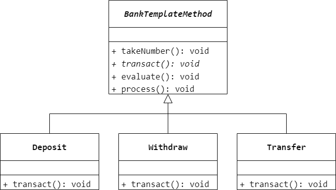
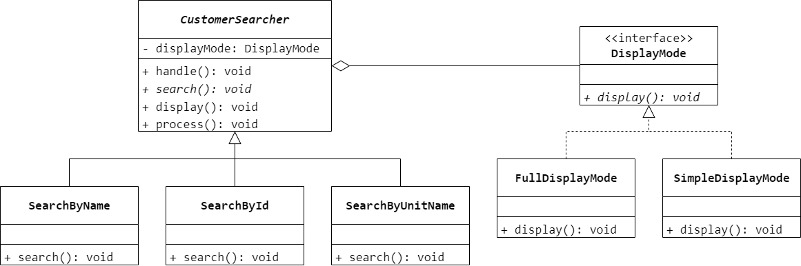

### 第 25 章　模板方法模式
1.　某系统中的某子模块需要为其他模块提供访问不同数据库系统（Oracle、SQL Server、DB2 等）的功能，这些数据库系统提供的访问接口有一定的差异，但访问过程却是相同的。例如先连接数据库，再打开数据库，最后对数据进行查询，可使用（$C$）设计模式抽象出相同的数据库访问过程。

$A.$ 观察者

$B.$ 访问者

$C.$ 模板方法

$D.$ 策略

<br/>

2.　以下关于模板方法模式的叙述错误的是（$B$）。

$A.$ 模板方法模式定义了一个操作中算法的骨架，而将一些步骤延迟到子类中

$B.$ 模板方法模式是一种对象行为型模式

$C.$ 模板方法使得子类可以不改变一个算法的结构即可重定义该算法的某些特定步骤

$D.$ 模板方法不仅可以调用原始的操作，还可以调用定义于 `AbstractClass` 中的方法或其他对象中的方法

<br/>

3.　在模板方法模式中，钩子方法如何实现子类控制父类的行为？

由于钩子方法通常返回一个 `boolean` 类型的值，并且以此来判断是否执行某一基本方法，因此在子类中可以通过覆盖钩子方法来决定是否执行父类中的某一方法，从而实现子类对父类行为的控制。

<br/>

4.　在银行办理业务时一般都包含几个基本步骤，首先需要取号排队，然后办理具体业务，最后需要对银行工作人员进行评分。无论具体业务是取款、存款还是转账，其基本流程都一样。现使用模板方法模式模拟银行业务办理流程，要求绘制相应的类图并使用 Java 语言编程模拟。



```Java
public abstract class BankTempMethod {
    public void tackNumber() {

    }
    public abstract void transact();
    public void evaluate() {

    }
    public void process() {
        tackNumber();
        transact();
        evaluate();
    }
}
```

```Java
public class Deposit extends BankTempMethod {
    @Override
    public void transact() {

    }
}
```

```Java
public class Withdraw extends BankTempMethod {
    @Override
    public void transact() {

    }
}
```

```Java
public class Transfer extends BankTempMethod {
    @Override
    public void transact() {

    }
}
```

<br/>

5.　某软件公司要开发一套客户信息管理系统，其中客户信息查询是其核心功能之一，具体来说，查询客户信息包含以下 3 个步骤：（1）对查询关键词进行检查与处理，例如判断查询关键词是否为空、去掉关键词前后的空格等。（2）根据用户指定的条件进行查询，可以根据客户姓名、客户编号、客户单位名称等查询，而且在将来可能还需要引入新的查询方式。（3）显示查询结果，系统提供了多种显示样式，例如完整模式、精简模式等，用户可以选择不同的显示样式。现需要在一个业务类中提供一个统一的方法来调用以上 3 个步骤，由于第（2）步和第（3）步存在可变性，因此决定使用模板方法模式和桥接模式联用来设计该功能。试绘制相应的结构图并给出核心实现代码。



```Java
public interface DisplayMode {
    void display();
}
```

```Java
public class FullDisplayMode implements DisplayMode {
    @Override
    public void display() {

    }
}
```

```Java
public class SimpleDisplayMode implements DisplayMode {
    @Override
    public void display() {

    }
}
```

```Java
public abstract class CustomerSearcher {
    private DisplayMode displayMode;
    public void handle() {

    }
    public abstract void search();
    public void display() {
        displayMode.display();
    }
    public void process() {
        handle();
        search();
        display();
    }
}
```

```Java
public class SearchByName extends CustomerSearcher {
    @Override
    public void search() {

    }
}
```

```Java
public class SearchById extends CustomerSearcher {
    @Override
    public void search() {

    }
}
```

```Java
public class SearchByUnitName extends CustomerSearcher {
    @Override
    public void search() {

    }
}
```