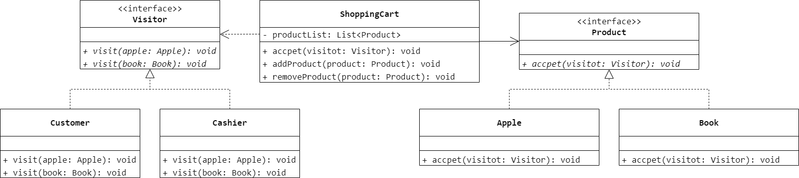
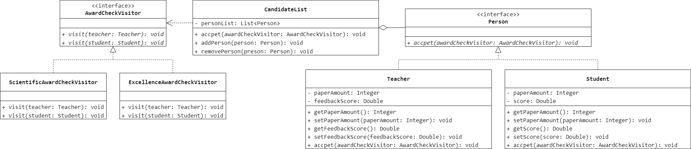

### 第 26 章　访问者模式
1.　关于访问者模式中的对象结构，以下描述错误的是（$A$）。

$A.$ 它实现了 `accept()` 方法，该操作以一个具体访问者作为参数

$B.$ 可以提供一个高层的接口以允许访问者访问它的元素

$C.$ 可以是一个组合模式或是一个集合

$D.$ 能够枚举其中包含的元素

<br/>

2.　以下关于访问者模式的叙述错误的是（$D$）。

$A.$ 访问者模式表示一个作用于某对象结构中的各元素的操作

$B.$ 访问者模式使用户可以在不改变各元素的类的前提下定义作用于这些元素的新操作

$C.$ 在访问者模式中 `ObjectStructure` 提供一个高层接口以允许访问者访问它的元素

$D.$ 在访问者模式中增加新的元素很容易

<br/>

3.　什么是双重分派机制？如何用代码实现？

略。

<br/>

4.　顾客在超市中将选择的商品（例如苹果、图书等）放在购物车中，然后到收银员处付款。在购物过程中顾客需要对这些商品进行访问，以便确认这些商品的质量，之后收银员计算价格时也需要访问购物车内顾客所选择的商品。此时，购物车作为一个对象结构用于存储各种类型的商品，而顾客和收银员作为访问这些商品的访问者，他们需要对商品进行检查和计价。不同类型的商品的访问形式也可能不同，如苹果需要过秤之后再计价，而图书不需要。使用访问者模式来模拟该购物过程，要求绘制对应的类图并使用 Java 语言模拟编程实现。



```Java
public interface Visitor {
    void visit(Apple apple);
    void visit(Book book);
}
```

```Java
public class Customer implements Visitor {
    @Override
    public void visit(Apple apple) {

    }
    @Override
    public void visit(Book book) {

    }
}
```

```Java
public class Cashier implements Visitor {
    @Override
    public void visit(Apple apple) {

    }
    @Override
    public void visit(Book book) {

    }
}
```

```Java
public interface Product {
    void accept(Visitor visitor);
}
```

```Java
public class Apple implements Product {
    @Override
    public void accept(Visitor visitor) {
        visitor.visit(this);
    }
}
```

```Java
public class Book implements Product {
    @Override
    public void accept(Visitor visitor) {
        visitor.visit(this);
    }
}
```

```Java
public class ShoppingCart {
    List<Product> productList = new ArrayList<>();
    public void accept(Visitor visitor) {
        for (int i = 0; i < productList.size(); i++) {
            productList.get(i).accept(visitor);
        }
    }
    public void addProduct(Product product) {
        productList.add(product);
    }
    public void removeProduct(Product product) {
        productList.remove(product);
    }
}
```

<br/>

5.　某软件公司要为某高校开发一套奖励审批系统，该系统可以实现教师奖励和学生奖励的审批（`Award Check`），如果教师发表论文数超过 10 篇或者学生论文数超过两篇可以评选科研奖，如果教师教学反馈分大于等于 90 分或者学生平均成绩大于等于 90 分可以评选成绩优秀奖。试使用访问者模式设计并实现该系统，以判断候选人集合中的教师或学生是否符合某种获奖要求。



```Java
public interface AwardCheckVisitor {
    void visit(Teacher teacher);
    void visit(Student student);
}
```

```Java
public class ScientificAwardCheckVisitor implements AwardCheckVisitor {
    @Override
    public void visit(Teacher teacher) {
        if (teacher.getPaperAmount() > 10) {

        }
    }
    @Override
    public void visit(Student student) {
        if (student.getPaperAmount() > 2) {

        }
    }
}
```

```Java
public class ExcellenceAwardCheckVisitor implements AwardCheckVisitor {
    @Override
    public void visit(Teacher teacher) {
        if (teacher.getFeedbackScore() >= 90.0) {

        }
    }
    @Override
    public void visit(Student student) {
        if (student.getScore() >= 90.0) {

        }
    }
}
```

```Java
public interface Person {
    void accept(AwardCheckVisitor awardCheckVisitor);
}
```

```Java
public class Teacher implements Person {
    private Integer paperAmount;
    private Double feedbackScore;
    public Integer getPaperAmount() {
        return paperAmount;
    }
    public void setPaperAmount(Integer paperAmount) {
        this.paperAmount = paperAmount;
    }
    public Double getFeedbackScore() {
        return feedbackScore;
    }
    public void setFeedbackScore(Double feedbackScore) {
        this.feedbackScore = feedbackScore;
    }
    @Override
    public void accept(AwardCheckVisitor awardCheckVisitor) {
        awardCheckVisitor.visit(this);
    }
}
```

```Java
public class Student implements Person {
    private Integer paperAmount;
    private Double score;
    public Integer getPaperAmount() {
        return paperAmount;
    }
    public void setPaperAmount(Integer paperAmount) {
        this.paperAmount = paperAmount;
    }
    public Double getScore() {
        return score;
    }
    public void setScore(Double score) {
        this.score = score;
    }
    @Override
    public void accept(AwardCheckVisitor awardCheckVisitor) {
        awardCheckVisitor.visit(this);
    }
}
```

```Java
public class CandidateList {
    private List<Person> personList = new ArrayList<>();
    public void accept(AwardCheckVisitor awardCheckVisitor) {
        for (int i = 0; i < personList.size(); i++) {
            personList.get(i).accept(awardCheckVisitor);
        }
    }
    public void addPerson(Person person) {
        personList.add(person);
    }
    public void removePerson(Person person) {
        personList.remove(person);
    }
}
```