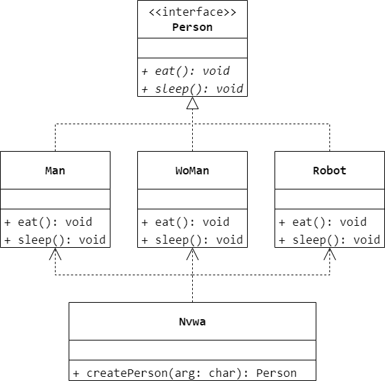
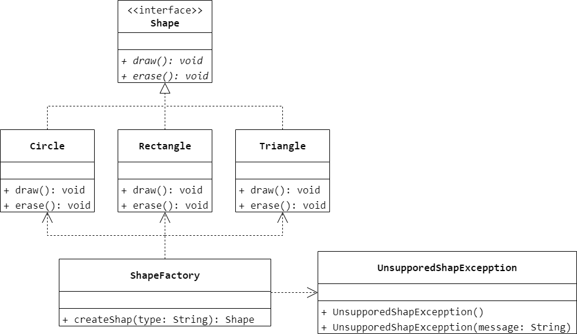

### 第 3 章　简单工厂模式
1.　在简单工厂模式中，如果需要增加新的具体产品，通常需要修改（$C$）的源代码。

$A.$ 抽象产品类

$B.$ 其他具体产品类

$C.$ 工厂类

$D.$ 客户类

<br/>

2.　以下关于简单工厂设计模式的叙述错误的是（$C$）。

$A.$ 简单工厂模式可以根据参数的不同返回不同的产品类的实例

$B.$ 简单工厂模式专门定义一个类来负责创建其他类的实例，被创建的实例通常都具有共同的父类

$C.$ 简单工厂模式可以减少系统中类的个数，简化系统设计，使得系统更易于理解

$D.$ 系统的扩展困难，在添加新的产品时需要修改工厂的业务逻辑，违背了开闭原则

<br/>

3.　以下代码使用了（$A$）模式。

```Java
public abstract class Product {
    public abstract void process();
}
```

```Java
public class ConcreteProductA extends Product {
    public void process() {
    }
}
```

```Java
public class ConcreteProductB extends Product {
    public void process() {
    }
}
```

```Java
public class Factory {
    public static Product createProduct(char type) {
        switch (type) {
            case 'A': {
                return new ConcreteProductA();
            }
            case 'B': {
                return new ConcreteProductB();
            }
        }
        return null;
    }
}
```

$A.$ Simple Factory

$B.$ Factory Method

$C.$ Abstract Factory

$D.$ 未使用任何设计模式

<br/>

4.　使用简单工厂模式模拟女娲（`Nvwa`）造人（`Person`），如果向造人的工厂方法传入参数“`M`”，则返回一个男人（`Man`）对象，如果传入参数“`W`”，则返回一个女人（`Woman`）对象，绘制相应的类图并使用 Java 语言模拟实现该场景。现需要增加一个新的机器人（`Robot`）类，如果传入参数“`R`”，则返回一个机器人对象，对代码进行修改并注意“女娲”类的变化。



```Java
public interface Person {
    void eat();
    void sleep();
}
```

```Java
public class Man implements Person {
    @Override
    public void eat() {

    }
    @Override
    public void sleep() {

    }
}
```

```Java
public class Woman implements Person {
    @Override
    public void eat() {

    }
    @Override
    public void sleep() {

    }
}
```

```Java
public class Robot implements Person {
    @Override
    public void eat() {

    }
    @Override
    public void sleep() {

    }
}
```

```Java
public class Nvwa {
    Person createPerson(char arg) {
        if (arg == 'W') {
            return new Man();
        }
        else if (arg == 'M') {
            return new Woman();
        }
        else if (arg == 'R') {
            return new Robot();
        }
        return null;
    }
}
```

<br/>

5.　使用简单工厂模式设计一个可以创建不同几何形状（`Shape`）的绘图工具类，例如圆形（`Circle`）、矩形（`Rectangle`）和三角形（`Triangle`）等，每个几何图形均具有绘制 `draw()` 和擦除 `erase()` 两个方法，要求在绘制不支持的几何图形时抛出一个 `UnsupportedShapeException` 异常，绘制类图并使用 Java 语言编程模拟实现。



```Java
public interface Shape {
    void draw();
    void erase();
}
```

```Java
public class Circle implements Shape {
    @Override
    public void draw() {

    }
    @Override
    public void erase() {

    }
}
```

```Java
public class Rectangle implements Shape {
    @Override
    public void draw() {

    }
    @Override
    public void erase() {

    }
}
```

```Java
public class Triangle implements Shape {
    @Override
    public void draw() {

    }
    @Override
    public void erase() {

    }
}
```

```Java
public class UnsupportedShapeException extends Exception {
    public UnsupportedShapeException() {

    }
    public UnsupportedShapeException(String message) {
        super(message);
    }
}
```

```Java
public class ShapeFactory {
    Shape createShape(String type) throws UnsupportedShapeException {
        if (Objects.equals(type, "Circle") == true) {
            return new Circle();
        }
        else if (Objects.equals(type, "Rectangle") == true) {
            return new Rectangle();
        }
        else if (Objects.equals(type, "Triangle") == true) {
            return new Triangle();
        }
        throw new UnsupportedShapeException();
    }
}
```