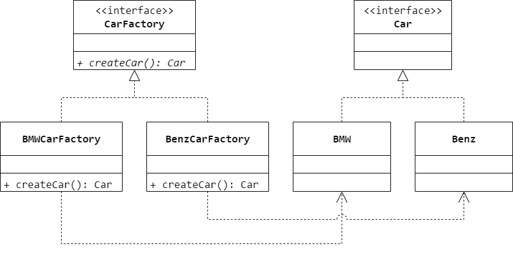

### 第 4 章　工厂方法模式
1.　不同品牌的手机应该由不同的公司制造，三星公司生产三星手机，苹果公司生产苹果手机。该场景蕴含了（$B$）模式。

$A.$ Simple Factory

$B.$ Factory Method

$C.$ Abstract Factory

$D.$ Builder

<br/>

2.　以下关于工厂方法模式的叙述错误的是（$D$）。

$A.$ 在工厂方法模式中引入了抽象工厂类，而具体产品的创建延迟到具体工厂中实现

$B.$ 工厂方法模式添加新的产品对象很容易，无须对原有系统进行修改，符合开闭原则

$C.$ 工厂方法模式存在的问题是在添加新产品时需要编写新的具体产品类，而且还要提供与之对应的具体工厂类，随着类个数的增加会给系统带来一些额外开销

$D.$ 工厂方法模式是所有形式的工厂模式中最为抽象和最具一般性的一种形态，工厂方法模式退化后可以演变成抽象工厂模式

<br/>

3.　某银行系统采用工厂模式描述其不同账户之间的关系，设计出的类图如图 4-7 所示。其中与工厂模式中的 `Creator` 角色相对应的类是（$① \ A$），与 `Product` 角色相对应的类是（$② \ B$）。

$① \ A.$ `Bank` $B.$ `Account` $C.$ `Checking` $D.$ `Savings`

$② \ A.$ `Bank` $B.$ `Account` $C.$ `Checking` $D.$ `Savings`

<br/>

4.　宝马（`BMW`）工厂制造宝马汽车，奔驰（`Benz`）工厂制造奔驰汽车。使用工厂方法模拟该场景，要求绘制相应的类图并使用 Java 语言模拟实现。



```Java
public interface Car {

}
```

```Java
public class BMW implements Car {

}
```

```Java
public class Benz implements Car {

}
```

```Java
public interface CarFactory {
    Car createCar();
}
```

```Java
public class BMWCarFactory implements CarFactory {
    @Override
    public Car createCar() {
        return new BMW();
    }
}
```

```Java
public class BenzCarFactory implements CarFactory {
    @Override
    public Car createCar() {
        return new Benz();
    }
}
```

<br/>

5.　在某数据统计系统中，曲线图创建器生成曲线图，柱状图创建器生成柱状图。试使用工厂方法模式设计该系统，要求绘制相应的类图并使用 Java 语言编程模拟实现。


```Java
public interface Chart {

}
```

```Java
public class LineChart implements Chart {

}
```

```Java
public class BarChart implements Chart {

}
```

```Java
public interface ChartFactory {
    Chart createChart();
}
```

```Java
public class LineChartFactory implements ChartFactory {
    @Override
    public Chart createChart() {
        return new LineChart();
    }
}
```

```Java
public class BarChartFactory implements ChartFactory {
    @Override
    public Chart createChart() {
        return new BarChart();
    }
}
```

<br/>

6.　某软件公司要开发一个数据格式转换工具，可以将不同数据源（如 TXT 文件、数据库、Excel 表格）中的数据转换成 XML 格式。为了让系统具有更好的拓展性，在未来支持新类型的数据源，开发人员决定使用工厂方法模式设计该工具。在工厂类中封装了具体转换类的初始化和创建过程，客户端只需要使用工厂类即可获得具体的转换类对象，再调用其相应方法实现数据转换操作。绘制该工具的类图并使用 Java 语言编程模拟实现，要求在实现时引入配置文件。


```Java
public interface Convertor {

}
```

```Java
public class TXTConvertor implements Convertor {

}
```

```Java
public class DatabaseConvertor implements Convertor {

}
```

```Java
public class ExcelConvertor implements Convertor {

}
```

```Java
public interface ConvertorFactory {
    Convertor createConvertor();
}
```

```Java
public class TXTConvertorFactory implements ConvertorFactory {
    @Override
    public Convertor createConvertor() {
        return new TXTConvertor();
    }
}
```

```Java
public class DatabaseConvertorFactory implements ConvertorFactory {
    @Override
    public Convertor createConvertor() {
        return new DatabaseConvertor();
    }
}
```

```Java
public class ExcelConvertorFactory implements ConvertorFactory {
    @Override
    public Convertor createConvertor() {
        return new ExcelConvertor();
    }
}
```

<br/>

7.　使用工厂方法模式设计一个程序用来读取各种不同类型的图片格式，针对每一种图片格式都设计一个图片读取器（`ImageReader`），例如 GIF 图片读取器（`GifReader`）用于读取 GIF 格式的图片、JPG 图片读取器（`JpgReader`）用于读取 JPG 格式的图片。注意，需要充分考虑系统的灵活性和可扩展性。


```Java
public interface ImageReader {

}
```

```Java
public class GifReader implements ImageReader {

}
```

```Java
public class JpgReader implements ImageReader {

}
```

```Java
public interface ImageReaderFactory {
    ImageReader createImageReader();
}
```

```Java
public class GifImageReaderFactory implements ImageReaderFactory {
    @Override
    public ImageReader createImageReader() {
        return new GifReader();
    }
}
```

```Java
public class JpgImageReaderFactory implements ImageReaderFactory {
    @Override
    public ImageReader createImageReader() {
        return new JpgReader();
    }
}
```