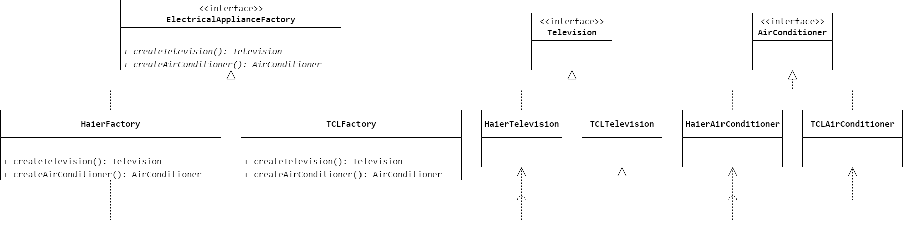

### 第 5 章　抽象工厂模式
1.　某公司要开发一个图表显示系统，在该系统中曲线图生成器可以创建曲线图、曲线图图例和曲线图数据标签，柱状图生成器可以创建柱状图、柱状图图例和柱状图数据标签。用户要求可以很方便地新增新的类型的图形，系统需具备较好的可扩展能力。针对这种需求，公司采用（$D$）最为恰当。

$A.$ 桥接模式

$B.$ 适配器模式

$C.$ 策略模式

$D.$ 抽象工厂模式

<br/>

2.　以下关于抽象工厂模式的叙述错误的是（$D$）。

$A.$ 抽象工厂模式提供了一个创建一系列相关或相互依赖对象的接口，而无须指定它们具体的类

$B.$ 当系统中有多于一个产品族时可以考虑使用抽象工厂模式

$C.$ 当一个工厂等级结构可以创建出分属于不同产品等级结构的一个产品族中的所有对象时，抽象工厂模式比工厂方法模式更为简单、有效率

$D.$ 抽象工厂模式符合开闭原则，增加新的产品族和新的产品等级结构都很方便

<br/>

3.　关于抽象工厂模式中的产品族和产品等级结构的叙述错误的是（$A$）。

$A.$ 产品等级结构是从不同的产品族中任意选取产品组成的层次结构

$B.$ 产品族是指位于不同产品结构等级结构、功能相关的产品组成的家族

$C.$ 抽象工厂是指一个工厂等级结构可以创建出分属于不同产品等级结构的一个产品族中的所有对象

$D.$ 工厂方法模式对应唯一一个产品等级结构，而抽象工厂模式需要面对多个产品等级结构

<br/>

4.　一个电器工厂可以产生多种类型的电器，如海尔工厂可以生产海尔电视机、海尔空调等，TCL 工厂可以生产 TCL 电视机、TCL 空调等，相同品牌的电器构成一个产品族，而相同类型的电器构成了一个产品等级结构，现使用抽象工厂模式模拟该场景。



```Java
public interface Television {

}
```

```Java
public class HaierTelevision implements Television {

}
```

```Java
public class TCLTelevision implements Television {

}
```

```Java
public interface AirConditioner {

}
```

```Java
public class HaierAirConditioner implements AirConditioner {

}
```

```Java
public class TCLAirConditioner implements AirConditioner {

}
```

```Java
public interface ElectricalApplianceFactory {
    Television createTelevision();
    AirConditioner createAirConditioner();
}
```

```Java
public class HaierFactory implements ElectricalApplianceFactory {
    @Override
    public Television createTelevision() {
        return new HaierTelevision();
    }
    @Override
    public AirConditioner createAirConditioner() {
        return new HaierAirConditioner();
    }
}
```

```Java
public class TCLFactory implements ElectricalApplianceFactory {
    @Override
    public Television createTelevision() {
        return new TCLTelevision();
    }
    @Override
    public AirConditioner createAirConditioner() {
        return new TCLAirConditioner();
    }
}
```

<br/>

5.　某系统为了改进数据库操作的性能，用户可以自定义数据库连接对象 `Connection` 和语句对象 `Statement`，针对不同类型的数据库提供不同的连接对象和语句对象，例如提供 Oracle 或 MySQL 专用连接类和语句类，而且用户可以通过配置文件等方式根据实际需要动态更换数据库。使用抽象工厂模式设计该系统，要求绘制对应的类图并使用 Java 语言编程模拟实现。


```Java
public interface Connection {

}
```

```Java
public class OracleConnection implements Connection {

}
```

```Java
public class MySQLConnection implements Connection {

}
```

```Java
public interface Statement {

}
```

```Java
public class OracleStatement implements Statement {

}
```

```Java
public class MySQLStatement implements Statement {

}
```

```Java
public interface DatabaseFactory {
    Connection createConnection();
    Statement createStatement();
}
```

```Java
public class OracleFactory implements DatabaseFactory {
    @Override
    public Connection createConnection() {
        return new OracleConnection();
    }
    @Override
    public Statement createStatement() {
        return new OracleStatement();
    }
}
```

```Java
public class MySQLFactory implements DatabaseFactory {
    @Override
    public Connection createConnection() {
        return new MySQLConnection();
    }
    @Override
    public Statement createStatement() {
        return new MySQLAirConditioner();
    }
}
```

<br/>

6.　某软件公司要推出一款新的手机游戏软件，该软件能够支持 iOS、Android 和 Windows Phone 等多个智能手机操作系统平台针对不同的手机操作系统，该游戏软件提供了不同的游戏操作控制（`OperationController`）类和游戏界面控制（`InterfaceController`）类，并提供相应的工厂类来封装这些类的初始化过程。软件要求具有较好的扩展性以支持新的操作系统平台，为了满足上述需求，试采用抽象工厂模式对其进行设计。


```Java
public interface OperationController {

}
```

```Java
public class SymbianOperationController implements OperationController {

}
```

```Java
public class AndroidOperationController implements OperationController {

}
```

```Java
public interface InterfaceController {

}
```

```Java
public class SymbianInterfaceController implements InterfaceController {

}
```

```Java
public class AndroidInterfaceController implements InterfaceController {

}
```

```Java
public interface MobileOperatingSystemFactory {
    OperationController createOperationController();
    InterfaceController createInterfaceController();
}
```

```Java
public class SymbianFactory implements MobileOperatingSystemFactory {
    @Override
    public OperationController createOperationController() {
        return new SymbianOperationController();
    }
    @Override
    public InterfaceController createInterfaceController() {
        return new SymbianInterfaceController();
    }
}
```

```Java
public class AndroidFactory implements MobileOperatingSystemFactory {
    @Override
    public OperationController createOperationController() {
        return new AndroidOperationController();
    }
    @Override
    public InterfaceController createInterfaceController() {
        return new AndroidInterfaceController();
    }
}
```

<br/>

7.　抽象工厂模式最早的应用之一是用来创建在不同操作系统的图形环境下都能够运行的应用程序，比如同时支持 Windows 与 Linux 操作系统。在每一个操作系统中都有一个由图形构件组成的构件家族，可以通过一个抽象角色给出功能定义，而由具体子类给出不同操作系统的具体实现，例如系统中包含两个产品等级结构，分别是 `Button` 与 `Text`；同时包含 3 个 产品族，即 `UNIX` 产品族、`Linux` 产品族与 `Windows` 产品族，如图 5-6 所示。在图 5-6 中，`Windows` 中的 `Button` 和 `Text` 构成了一个 `Windows` 产品族，而不同操作系统下的 `Button` 构成了一个产品等级结构。试使用抽象工厂模式来设计并模拟实现该结构。


```Java
public interface Button {

}
```

```Java
public class UnixButton implements Button {

}
```

```Java
public class LinuxButton implements Button {

}
```

```Java
public class WindowsButton implements Button {

}
```

```Java
public interface Text {

}
```

```Java
public class UnixText implements Text {

}
```

```Java
public class LinuxText implements Text {

}
```

```Java
public class WindowsText implements Text {

}
```

```Java
public interface ComponentFactory {
    Button createButton();
    Text createText();
}
```

```Java
public class UinxFactory implements ComponentFactory {
    @Override
    public Button createButton() {
        return new UnixButton();
    }
    @Override
    public Text createText() {
        return new UnixText();
    }
}
```

```Java
public class LinuxFactory implements ComponentFactory {
    @Override
    public Button createButton() {
        return new LinuxButton();
    }
    @Override
    public Text createText() {
        return new LinuxText();
    }
}
```

```Java
public class WindowsFactory implements ComponentFactory {
    @Override
    public Button createButton() {
        return new WindowsButton();
    }
    @Override
    public Text createText() {
        return new WindowsText();
    }
}
```