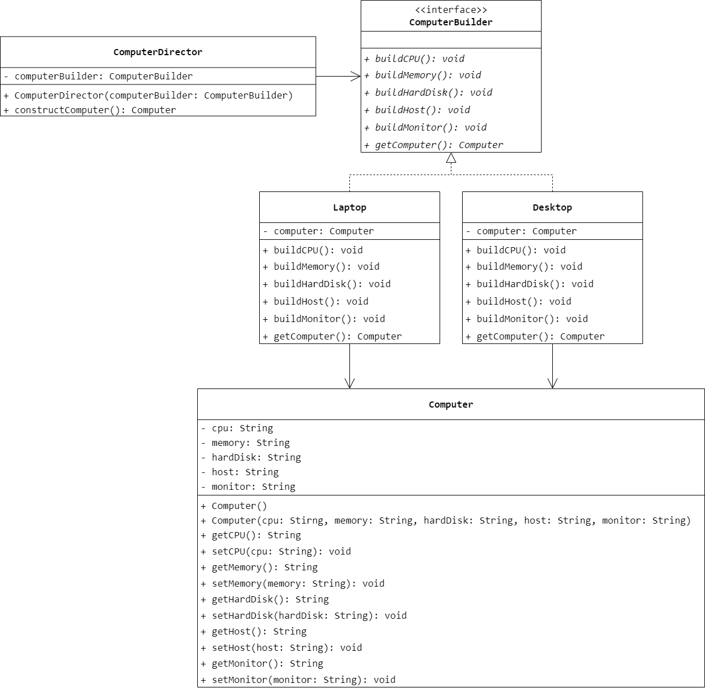
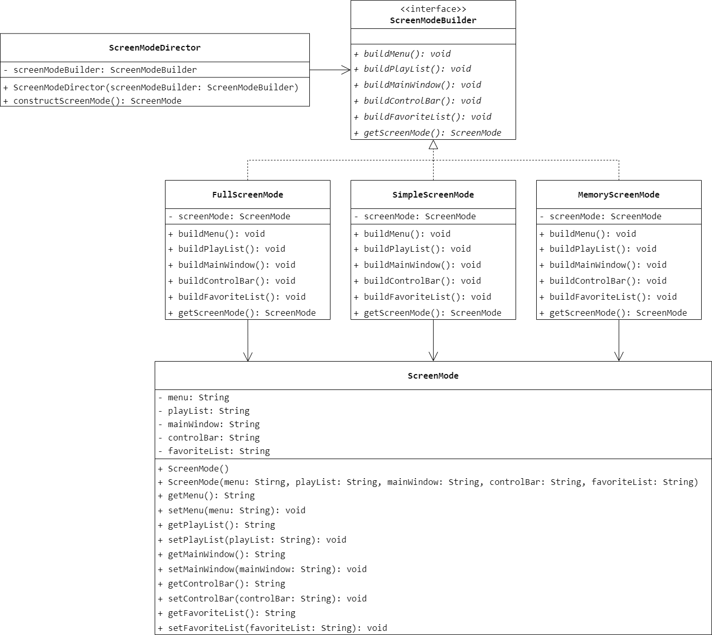

### 第 6 章　建造者模式
1.　以下关于建造者模式的叙述错误的是（$D$）。

$A.$ 建造者模式将一个复杂对象的构建与它的表示分离，使得同样的构建过程可以创建不同的表示

$B.$ 建造者模式允许用户只通过指定复杂对象的类型和内容就可以创建它们，而不需要知道内部的具体细节

$C.$ 当需要创建的产品对象有复杂的内部结构时可以考虑使用建造者模式

$D.$ 在建造者模式中，各个具体的建造者之间通常具有较强的依赖关系，可以通过指挥类组装成一个完整的产品对象返回给客户

<br/>

2.　当需要创建的产品具有复杂的内部结构时，为了逐步构造完整对象，并使得对象的创建更具有灵活性，可以使用（$C$）。

$A.$ 抽象工厂模式

$B.$ 原型模式

$C.$ 建造者模式

$D.$ 单例模式

<br/>

3.　关于建造者模式中的 `Director` 类的描述错误的是（$D$）。

$A.$ `Director` 类隔离了客户类及创建过程

$B.$ 在建造者模式中客户类指导 `Director` 去生成对象或者合成一些类，并逐步构造一个复杂对象

$C.$ `Director` 类构建一个抽象建造者 `Builder` 子类对象

$D.$ `Director` 与抽象工厂模式中的工厂类类似，负责返回一个产品族中的所有产品

<br/>

4.　电脑组装工厂可以将 CPU、内存、硬盘、主机、显示器等硬件设备组装在一起构成一台完整的电脑，且构成的电脑可以是笔记本，也可以是台式机，还可以是不提供显示器的服务器主机。对于用户而言，无须关心电脑的组成设备和组装过程，工厂返回给用户的完整的电脑对象。使用建造者模式实现电脑组装过程，要求绘制类图并使用 Java 代码编程模拟实现。



```Java
public class Computer {
    private String cpu;
    private String memory;
    private String hardDisk;
    private String host;
    private String monitor;
    public Computer() {

    }
    public Computer(String cpu, String memory, String hardDisk, String host, String monitor) {
        this.cpu = cpu;
        this.memory = memory;
        this.hardDisk = hardDisk;
        this.host = host;
        this.monitor = monitor;
    }
    public String getCPU() {
        return cpu;
    }
    public void setCPU(String cpu) {
        this.cpu = cpu;
    }
    public String getMemory() {
        return memory;
    }
    public void setMemory(String memory) {
        this.memory = memory;
    }
    public String getHardDisk() {
        return hardDisk;
    }
    public void setHardDisk(String hardDisk) {
        this.hardDisk = hardDisk;
    }
    public String getHost() {
        return host;
    }
    public void setHost(String host) {
        this.host = host;
    }
    public String getMonitor() {
        return monitor;
    }
    public void setMonitor(String monitor) {
        this.monitor = monitor;
    }
}
```

```Java
public interface ComputerBuilder {
    void buildCPU();
    void buildMemory();
    void buildHardDisk();
    void buildHost();
    void buildMonitor();
    Computer getComputer();
}
```

```Java
public class Laptop implements ComputerBuilder {
    private Computer computer = new Computer();
    @Override
    public void buildCPU() {
        computer.setCPU("Laptop CPU");
    }
    @Override
    public void buildMemory() {
        computer.setMemory("Laptop Memory");
    }
    @Override
    public void buildHardDisk() {
        computer.setMemory("Laptop HardDisk");
    }
    @Override
    public void buildHost() {
        computer.setMemory("Laptop Host");
    }
    @Override
    public void buildMonitor() {
        computer.setMemory("Laptop Monitor");
    }
    @Override
    public Computer getComputer() {
        return computer;
    }
}
```

```Java
public class Desktop implements ComputerBuilder {
    private Computer computer = new Computer();
    @Override
    public void buildCPU() {
        computer.setCPU("Desktop CPU");
    }
    @Override
    public void buildMemory() {
        computer.setMemory("Desktop Memory");
    }
    @Override
    public void buildHardDisk() {
        computer.setMemory("Desktop HardDisk");
    }
    @Override
    public void buildHost() {
        computer.setMemory("Desktop Host");
    }
    @Override
    public void buildMonitor() {
        computer.setMemory("Desktop Monitor");
    }
    @Override
    public Computer getComputer() {
        return computer;
    }
}
```

```Java
public class ComputerDirector {
    private ComputerBuilder computerBuilder;
    public ComputerDirector(ComputerBuilder computerBuilder) {
        this.computerBuilder = computerBuilder;
    }
    public Computer constructComputer() {
        computerBuilder.buildCPU();
        computerBuilder.buildMemory();
        computerBuilder.buildHardDisk();
        computerBuilder.buildHost();
        computerBuilder.buildMonitor();
        return computerBuilder.getComputer();
    }
}
```

<br/>

5.　某软件公司要开发一个视频播放软件，为了给用户的使用提供方便，该播放软件提供多种界面显示模式，如完整模式、精简模式、记忆模式、网络模式等。在不同的显示模式下主界面的组成元素有所差异，如在完整模式下将显示菜单、播放列表、主窗口、控制条等，在精简模式下只显示主窗口和控制条，而在记忆模式下将显示主窗口、控制条、收藏列表等。试使用建造者模式设计该软件。



```Java
public class ScreenMode {
    private String menu;
    private String playList;
    private String mainWindow;
    private String controlBar;
    private String favoriteList;
    public ScreenMode() {

    }
    public ScreenMode(String menu, String playList, String mainWindow, String controlBar, String favoriteList) {
        this.menu = menu;
        this.playList = playList;
        this.mainWindow = mainWindow;
        this.controlBar = controlBar;
        this.favoriteList = favoriteList;
    }
    public String getMenu() {
        return menu;
    }
    public void setMenu(String menu) {
        this.menu = menu;
    }
    public String getPlayList() {
        return playList;
    }
    public void setPlayList(String playList) {
        this.playList = playList;
    }
    public String getMainWindow() {
        return mainWindow;
    }
    public void setMainWindow(String mainWindow) {
        this.mainWindow = mainWindow;
    }
    public String getControlBar() {
        return controlBar;
    }
    public void setControlBar(String controlBar) {
        this.controlBar = controlBar;
    }
    public String getFavoriteList() {
        return favoriteList;
    }
    public void setFavoriteList(String favoriteList) {
        this.favoriteList = favoriteList;
    }
}
```

```Java
public interface ScreenModeBuilder {
    void buildMenu();
    void buildPlayList();
    void buildMainWindow();
    void buildControlBar();
    void buildFavoriteList();
    ScreenMode getScreenMode();
}
```

```Java
public class FullScreenMode implements ScreenModeBuilder {
    private ScreenMode screenMode = new ScreenMode();
    @Override
    public void buildMenu() {
        screenMode.setMenu("Menu");
    }
    @Override
    public void buildPlayList() {
        screenMode.setPlayList("PlayList");
    }
    @Override
    public void buildMainWindow() {
        screenMode.setMainWindow("MainWindow");
    }
    @Override
    public void buildControlBar() {
        screenMode.setControlBar("ControlBar");
    }
    @Override
    public void buildFavoriteList() {
        screenMode.setFavoriteList("FavoriteList");
    }
    @Override
    public ScreenMode getScreenMode() {
        return screenMode;
    }
}
```

```Java
public class SimpleScreenMode implements ScreenModeBuilder {
    private ScreenMode screenMode = new ScreenMode();
    @Override
    public void buildMenu() {
        screenMode.setMenu(null);
    }
    @Override
    public void buildPlayList() {
        screenMode.setPlayList(null);
    }
    @Override
    public void buildMainWindow() {
        screenMode.setMainWindow("MainWindow");
    }
    @Override
    public void buildControlBar() {
        screenMode.setControlBar("ControlBar");
    }
    @Override
    public void buildFavoriteList() {
        screenMode.setFavoriteList(null);
    }
    @Override
    public ScreenMode getScreenMode() {
        return screenMode;
    }
}
```

```Java
public class MemoryScreenMode implements ScreenModeBuilder {
    private ScreenMode screenMode = new ScreenMode();
    @Override
    public void buildMenu() {
        screenMode.setMenu(null);
    }
    @Override
    public void buildPlayList() {
        screenMode.setPlayList(null);
    }
    @Override
    public void buildMainWindow() {
        screenMode.setMainWindow("MainWindow");
    }
    @Override
    public void buildControlBar() {
        screenMode.setControlBar("ControlBar");
    }
    @Override
    public void buildFavoriteList() {
        screenMode.setFavoriteList("FavoriteList");
    }
    @Override
    public ScreenMode getScreenMode() {
        return screenMode;
    }
}
```

```Java
public class ScreenModeDirector {
    private ScreenModeBuilder screenModeBuilder;
    public ScreenModeDirector(ScreenModeBuilder screenModeBuilder) {
        this.screenModeBuilder = screenModeBuilder;
    }
    public ScreenMode constructScreenMode() {
        screenModeBuilder.buildMenu();
        screenModeBuilder.buildPlayList();
        screenModeBuilder.buildMainWindow();
        screenModeBuilder.buildControlBar();
        screenModeBuilder.buildFavoriteList();
        return screenModeBuilder.getScreenMode();
    }
}
```