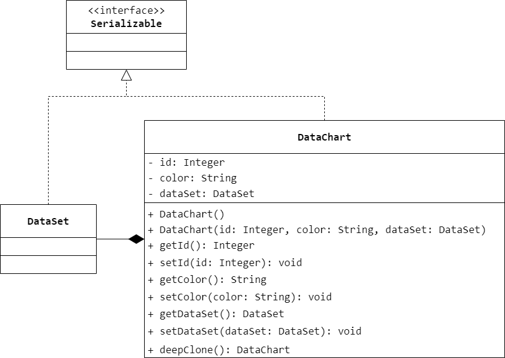
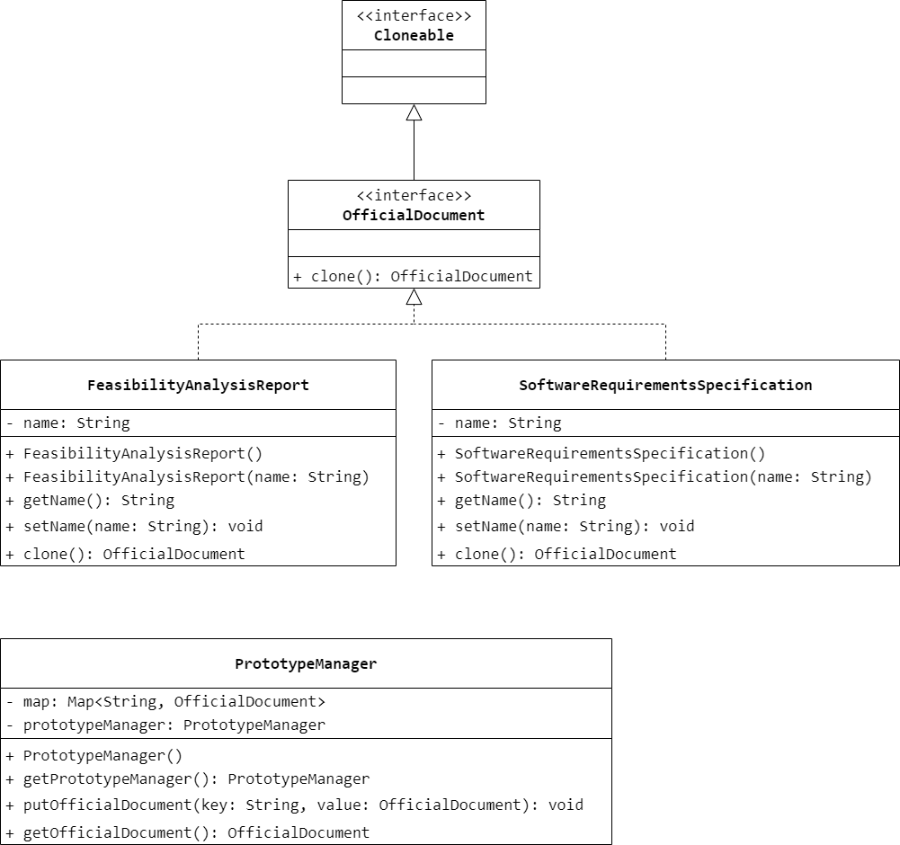
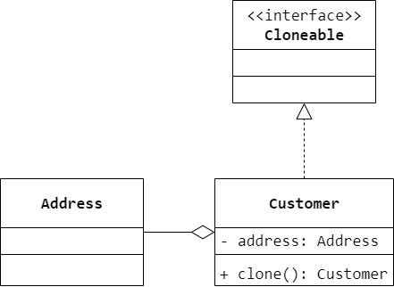
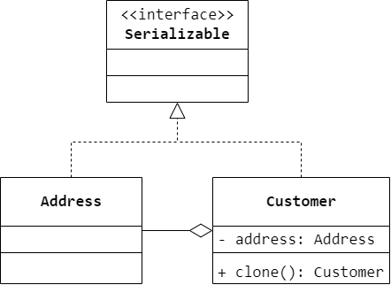

### 第 7 章　原型模式
1.　关于 Java 语言中的 `clone()` 方法，以下叙述有误的一项是（$A$）。

$A.$ 对于对象 `x`，都有 `x.clone() == x`

$B.$ 对于对象 `x`，都有 `x.clone().getClass() == x.getClass()`

$C.$ 对于对象 `x` 的成员对象 `member`，都有 `x.clone().getMember() == x.getMember()`

$D.$ 对于对象 `x` 的成员对象 `member`，都有 `x.clone().getMember().getClass() == x.getMember().getClass()`

<br/>

2.　以下关于原型模式的叙述错误的是（$D$）。

$A.$ 原型模式通过给出一个原型对象来指明所要创建的对象的类型，然后用复制这个原型对象的办法创建出更多同类型的对象

$B.$ 浅克隆仅仅复制所考虑的对象，而不复制它所引用的对象，也就是其中的成员对象并不复制

$C.$ 在原型模式中实现深克隆通常需要编写较为复杂的代码

$D.$ 在原型模式中不需要为每一个类配备一个克隆方法，因此对于原型模式的扩展很灵活，对于已有类的改造也较为容易

<br/>

3.　某公司要开发一个即时聊天软件，用户在聊天过程中可以与多位好友同时聊天，在私聊时将产生多个聊天窗口，为了提高聊天窗口的创建效率，要求根据第一个窗口快速创建其他窗口。针对这种需求，采用（$C$）进行设计最为合适。

$A.$ 享元模式

$B.$ 单例模式

$C.$ 原型模式

$D.$ 组合模式

<br/>

4.　某数据处理软件需要增加一个图表复制功能，在图表（`DataChart`）对象中包含一个数据集（`DataSet`）对象，数据集对象用于封装待显示的数据，用户可以通过界面上的“复制”按钮将该图表复制一份，复制后即可得到新的图表对象，然后可以修改新图表的编号、颜色和数据。试使用原型模式设计该软件并使用 Java 语言模式深克隆实现。



```Java
public class DataSet implements Serializable {

}
```

```Java
public class DataChart implements Serializable {
    private Integer id;
    private String color;
    private DataSet dataSet;
    public DataChart() {

    }
    public DataChart(Integer id, String color, DataSet dataSet) {
        this.id = id;
        this.color = color;
        this.dataSet = dataSet;
    }
    public Integer getId() {
        return id;
    }
    public void setId(Integer id) {
        this.id = id;
    }
    public String getColor() {
        return color;
    }
    public void setColor(String color) {
        this.color = color;
    }
    public DataSet getDataSet() {
        return dataSet;
    }
    public void setDataSet(DataSet dataSet) {
        this.dataSet = dataSet;
    }
    public DataChart deepClone() throws Exception {
        ByteArrayOutputStream baos = new ByteArrayOutputStream();
        ObjectOutputStream oos = new ObjectOutputStream(baos);
        oos.writeObject(this);
        ByteArrayInputStream bais = new ByteArrayInputStream(baos.toByteArray());
        ObjectInputStream ois = new ObjectInputStream(bais);
        return (DataChart) ois.readObject();
    }
}
```

<br/>

5.　某公司要创建一个公文管理器，在公文管理器中提供一个集合对象来存储一些常用的公文模板，用户可以通过复制这些公文模板快速创建新的公文。试使用带有原型管理器的原型模式来设计该公文管理器并使用 Java 代码编程模拟。



```Java
public interface OfficialDocument extends Cloneable {
    OfficialDocument clone();
}
```

```Java
public class FeasibilityAnalysisReport implements OfficialDocument {
    private String name;
    public FeasibilityAnalysisReport() {

    }
    public FeasibilityAnalysisReport(String name) {
        this.name = name;
    }
    public String getName() {
        return name;
    }
    public void setName(String name) {
        this.name = name;
    }
    @Override
    public OfficialDocument clone() {
        try {
            return (OfficialDocument) super.clone();
        }
        catch (CloneNotSupportedException exc) {
            exc.printStackTrace();
        }
        return null;
    }
}
```

```Java
public class SoftwareRequirementsSpecification implements OfficialDocument {
    private String name;
    public SoftwareRequirementsSpecification() {

    }
    public SoftwareRequirementsSpecification(String name) {
        this.name = name;
    }
    public String getName() {
        return name;
    }
    public void setName(String name) {
        this.name = name;
    }
    @Override
    public OfficialDocument clone() {
        try {
            return (OfficialDocument) super.clone();
        }
        catch (CloneNotSupportedException exc) {
            exc.printStackTrace();
        }
        return null;
    }
}
```

```Java
public class PrototypeManager {
    private Map<String, OfficialDocument> map = new HashMap<>();
    private static PrototypeManager prototypeManager = new PrototypeManager();
    public PrototypeManager() {
        map.put("可行性分析报告", new FeasibilityAnalysisReport("可行性分析报告"));
        map.put("软件需求规格说明书", new FeasibilityAnalysisReport("软件需求规格说明书"));
    }
    public static PrototypeManager getPrototypeManager() {
        return prototypeManager;
    }
    public void putOfficialDocument(String key, OfficialDocument value) {
        map.put(key, value);
    }
    public OfficialDocument getOfficialDocument(String key) {
        return map.get(key).clone();
    }
}
```

<br/>

6.　请为某销售系统设计并实现一个客户类 `Customer`，在客户类中包含一个名为客户地址的成员变量，客户地址的类型为 `Address`，用浅克隆和深克隆分别实现 `Customer` 独享的复制并比较这两种克隆方式的异同。



```Java
public class Address {

}
```

```Java
public class Customer implements Cloneable {
    private Address address;
    public Customer() {
        address = new Address();
    }
    public Customer clone() {
        try {
            return (Customer) super.clone();
        }
        catch (CloneNotSupportedException exc) {
            exc.printStackTrace();
        }
        return null;
    }
}
```



```Java
public class Address implements Serializable {

}
```

```Java
public class Customer implements Serializable {
    private Address address;
    public Customer() {
        address = new Address();
    }
    public Customer deepClone() throws Exception {
        ByteArrayOutputStream baos = new ByteArrayOutputStream();
        ObjectOutputStream oos = new ObjectOutputStream(baos);
        oos.writeObject(this);
        ByteArrayInputStream bais = new ByteArrayInputStream(baos.toByteArray());
        ObjectInputStream ois = new ObjectInputStream(bais);
        return (Customer) ois.readObject();
    }
}
```