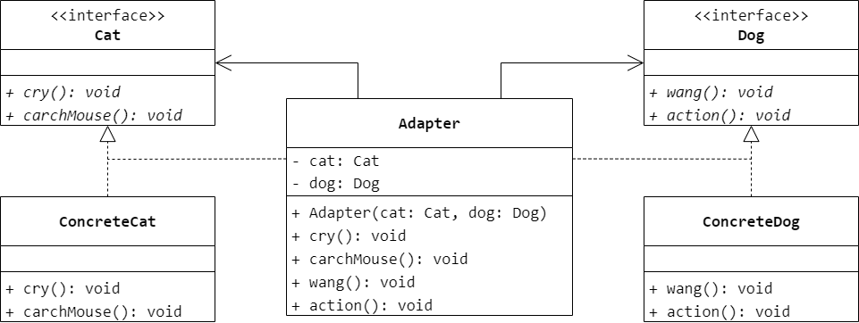
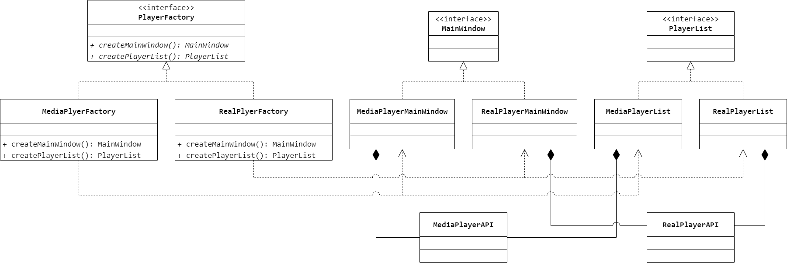
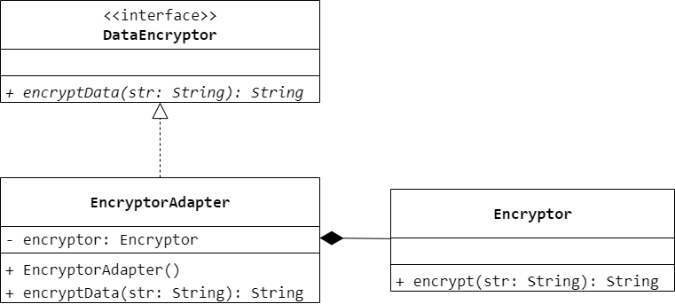

### 第 9 章　适配器模式
1.　（$B$）将一个类的接口转换成客户希望的另外一个接口，使得原本由于接口不兼容而不能一起工作的那些类可以一起工作。

$A.$ 命令模式（Command）

$B.$ 适配器模式（Adapter）

$C.$ 策略模式（Strategy）

$D.$ 单例模式（Singleton）

<br/>

2.　以下关于适配器的叙述错误的是（$C$）。

$A.$ 适配器模式将一个接口转换成客户希望的另一个接口，使得原本接口不兼容的那些类可以一起工作

$B.$ 在类适配器中 `Adapter` 和 `Adaptee` 是继承关系，而在对象适配器中 `Adapter` 和 `Adaptee` 是关联关系

$C.$ 类适配器比对象适配器更加灵活，在 Java 语言中可以通过类适配器一次适配多个适配者类

$D.$ 适配器可以在不修改原来的适配者接口 `Adaptee` 的情况下将一个类的接口和另一个类的接口匹配起来

<br/>

3.　现需要开发一个文件转换软件，将文件由一种格式转换为另一种格式，例如将 XML 文件转换为 PDF 文件、将 DOC 文件转换为 TXT 文件，有些文件格式转换代码已经存在，为了将已有的代码应用于新软件而不需要修改软件的整体结构，可以使用（$A$）设计模式进行系统设计。

$A.$ 适配器（Adapter）

$B.$ 组合（Composite）

$C.$ 外观（Facade）

$D.$ 桥接（Bridge）

<br/>

4.　在对象适配器中，适配类（`Adapter`）和适配者（`Adaptee`）之间的关系为（$A$）。

$A.$ 关联关系

$B.$ 依赖关系

$C.$ 继承关系

$D.$ 实现关系

<br/>

5.　在对象适配器中一个适配器能否适配多个者？如果能，应该如何实现？如果不能，请说明原因。如果是类适配器呢？

在对象适配器中，适配器与适配者之间是关联关系，一个适配器能够对应多个适配者类，
只需要在该适配器类中定义对多个适配者对象的引用即可；在类适配器中，适配器与适配者是继承关系，一个适配器能否适配多个适配者类取决于该编程语言是否支持多重类继承，例如 C++ 语言支持多重类继承则可以适配多个适配者，而 Java、C# 等语言不支持多重类继承则不能适配多个适配者。

<br/>

6.　使用 Java 语言实现一个双向适配器实例，使得猫（`Cat`）可以学狗（`Dog`）叫（`cry()`），狗可以学猫抓老鼠（`catchMouse()`）。绘制相应类图并编程模拟实现。



```Java
public interface Cat {
    void cry();
    void catchMouse();
}
```

```Java
public class ConcreteCat implements Cat {
    @Override
    public void cry() {

    }
    @Override
    public void catchMouse() {

    }
}
```

```Java
public interface Dog {
    void wang();
    void action();
}
```

```Java
public class ConcreteDog implements Dog {
    @Override
    public void wang() {

    }
    @Override
    public void action() {

    }
}
```

```Java
public class Adapter implements Cat, Dog {
    private Cat cat;
    private Dog dog;
    public Adapter(Cat cat, Dog dog) {
        this.cat = cat;
        this.dog = dog;
    }
    @Override
    public void cry() {
        dog.wang();
    }
    @Override
    public void catchMouse() {
        cat.catchMouse();
    }
    @Override
    public void wang() {
        dog.wang();
    }
    @Override
    public void action() {
        cat.catchMouse();
    }
}
```

<br/>

7.　Windows Meida Player 和 RealPlayer 是两种常用的媒体播放器，它们的 API 结构和调用方法存在区别。现在你的应用程序需要支持这两种播放器 API，而且在将来可能还需要支持新的媒体播放器，请问如何设计该应用程序？



<br/>

8.　某 OA 系统需要提供一个加密模块，将用户机密信息（例如口令、邮箱等）加密之后存储在数据库中，系统已经定义好了数据库操作类。为了提高开发效率，现需要重用已有的加密算法，这些算法封装在一些由第三方提供的类中，有些甚至没有源代码。试使用适配器模式设计该加密模块，实现在不修改现有类的基础上重用第三方加密方法。要求绘制相应的类图并使用 Java 语言编程模拟实现，需提供对象适配器和类适配器两套实现方案。



```Java
public interface DataEncryptor {
    String encryptData(String str);
}
```

```Java
public class Encryptor {
    String encrypt(String str) {
        return str;
    }
}
```

```Java
public class EncryptorAdapter implements DataEncryptor {
    private Encryptor encryptor;
    public EncryptorAdapter() {
        encryptor = new Encryptor();
    }
    @Override
    public String encryptData(String str) {
        return encryptor.encrypt(str);
    }
}
```